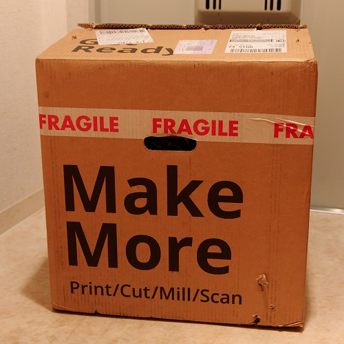
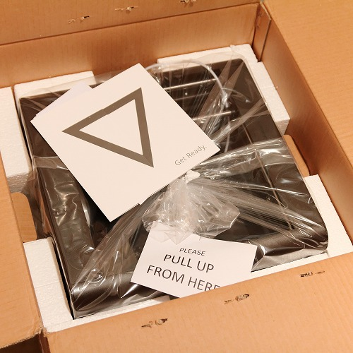
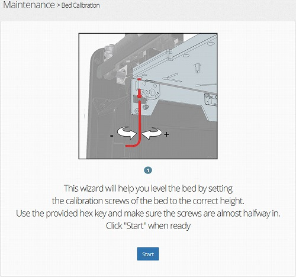
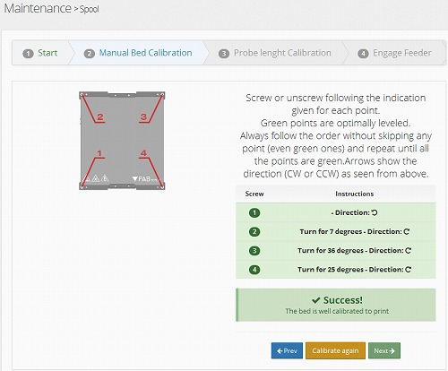
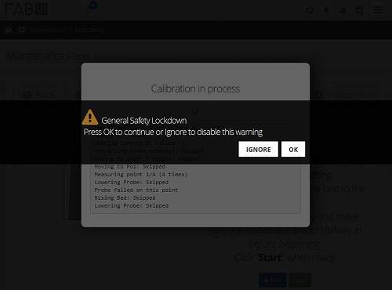
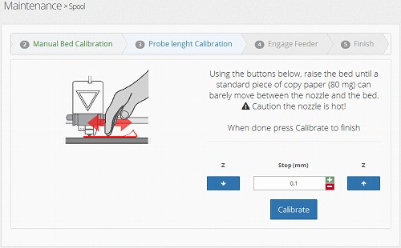
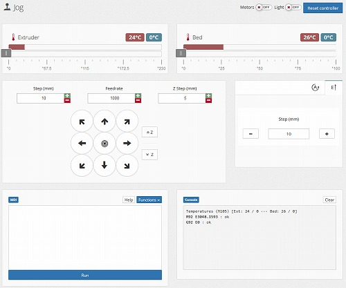
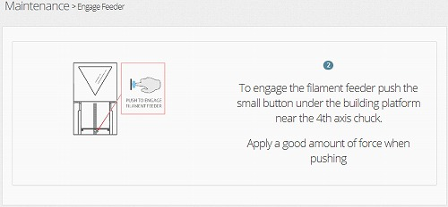
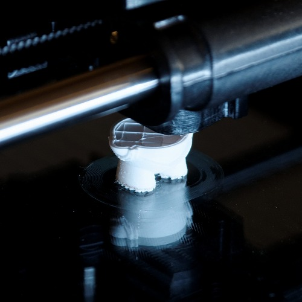
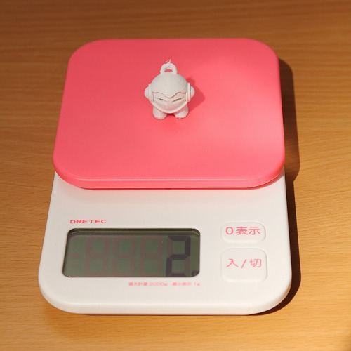

// このエントリは再構築されました

# はじめに

先日 [Fabtotum](http://www.fabtotum.com) (という3Dプリンタ)を入手したので、その立ち上げに関するメモを残します。

実際、立ち上げ用のドキュメントが封入＆Webベースのウィザードがあるので、取説を読む人であれば、あまり苦労することなく立ち上げられるとは思いますが。

# Fabtotumとは

Fabtotum を一言で表現すれば3Dプリンタなんですが、最近は3Dプリンタも種類が多いので他機種との違いも含めて私が感じた特徴は以下のとおり。

  * 多機能(3Dプリンタ+3Dスキャナ+切削加工機)
  * 最大造形サイズが大きい(200mm立法以上)
  * ヒートベッドがガラス(完成品が取り外し易い)
  * インタフェースがWebベース(本体に操作パネルなどはない)
  * オープンソース(CC BY-NC-SA 3.0)
  * 制御基板は Rasberry Pi (model B) + Arduino
  * 4軸(XYZθ, ファーム修正で5軸化の余地あり)
  * 価格 $1,599 (現状$1,249)

CAD図とソースコードは以下  
<https://grabcad.com/library/fabtotum-2>  
<https://github.com/FABtotum>

# Fabtotum到着から開梱、ネットワーク設定まで

Fabtotumはイタリア製なので、イタリアから日本までの輸送に約1週間かかりました。途中、パリ、ニューデリー、広州とあちこち経由したせいか、到着した時には
箱がボッコボコ。中身が大丈夫かちょっと心配になったのですが、厚い発泡スチロールで保持されており、何も問題はありませんでした。

“PULL UP FROM HERE” とあるだけで、よく考えられていることが伺われました。  

この後、箱から引っ張り出して開梱、ネットワーク設定をしたのですが、その際の手順を説明した動画があるので貼っておきます。基本的に動画のとおりで問題ないはずです
が、「Fabtotumの有線LANは固定IPなのでPCと直結しないと通信できない」とか「無線LANのパスワード設定で間違ったパスワードを入力してもOKと表示
される」ので無線LANで通信できないときはパスワードを確認した方がいいかもしれません。

# 初期設定1 ベッド調整

ネットワーク設定が終わった後はFirst Setup のウィザードに沿って「ベッドの水平出し」、「ヘッドの高さ調整」、「フィラメント用ガイドチューブの取り付
け」の3つの調整を行うのですが、このエントリの内容は「ベッドの水平出し」についてです。

Fabtotumでは、3Dプリント時において、ベッドが上下することでZ軸方向の積層を行うため、プリント前にベッドの水平を出しておかなければなりません。ベッド
は4隅で支持されており、この4点の高さを調整することで水平出しを行います。 

完了すると以下のようになります。 

基本的にウィザード通りに作業すれば良いのですが、ベッドの支持体の剛性(特にXY方向)があまり高くないので、少しずつ追い込まないとうまくいきません。さて、言葉
で説明するのは簡単なのですが、私はここで2か所ほどハマりました。

1つ目は「**ベッドを上げすぎてベッドを暖めるための接点が接触しなくなった**」というものです。First Setup の後、テストプリントを行う前に
Maintenance の Self Test を走らせてみたのですが、そのとき「FAILED : Building plane recognition」と
表示されてしまいました。公式Forumを検索すると、これはベッドの接触不良時に現れるエラーと分かったので接点部分をよく見てみるとベッドが高すぎて物理的に接触
していなくなっていました。

2つ目は「**エクストルーダが原点隅にスタックした**」というものです。あるとき、水平出しを開始しようとすると「General Safety
Lockdown」のエラーが出てきて測定が行えなくなってしまいました。

原因を公式Forumで検索すると、前面パネルがちゃんと閉じていないとそのエラーが出るとのことで、前面パネルのセンサを無効にしてみたのですがそれでも解決せず。
ソースを読んで解析しようかと読みかけるところまでいったんですが、ふとJOG操作してみるとXY操作時に同様のエラーが出て動かなかったので、もしかと思ってエクス
トルーダを手動でずらしてやると解決。要はエクストルーダがリミットスイッチを押しっぱなしの状態になっていたため先のエラーが出ており、前面パネルなんて全く関係あ
りませんでした。

必須ではありませんが、ベッド調整は以下のものがあると作業しやすくなります。

  * 懐中電灯
  * 水準器

# 初期設定2 ヘッドの高さ調整

この工程ではヘッドとベッドの隙間を調整します。 

指示通りにコピー用紙を動かしてZを調整するだけなのですが、ここにもハマりどころがありました。「ベッドの水平出し」はヘッドとベッドを暖めずに行うのですが「ヘッ
ドの高さ調整」は暖めて行います。そのためサクサク調整するとベッドが暖まりきる前に調整が終わります。ここで物体は暖まると膨張するので、冷たいときにスレスレなら
暖めると衝突してしまい、プリント時にヘッドがベッドを削るということが起こります。(私は削ってしまいました)

致命的な問題ではないですが、初めてのプリントで傷つけるというのは、気分的に良くないです。

# 初期設定3 フィーダ取り付け

最後は意味不明な難所、フィラメント用ガイドチューブの取り付けです。

ウィザード通りに作業してもうまくいかず、公式Forumに"うまくいかないんだけど"とスレが立つくらいには意味不明で、私もこの作業には4日くらい費やしてしまい
ました。

試行錯誤の結果、こうすれば良いのでは？という手順が以下になります。

  1. JOG の E↑ を使ってチューブから出ない程度までフィラメントを引っ込める  
(E↑はJOG画面の中段右)

  2. ガイドチューブをエクストルーダに強く押し込む  
(ここでカチッと音がする)

  3. Engage 用のボタンを押す  
(この工程は不要かもしれない)

  4. JOG で Extruder を210℃まで暖める  
(PLA時、ABS時はもう少し高温にする)

  5. JOG の E↑ を使ってフィラメントを出す  
(うまくいけばヘッドの先から溶けたフィラメントが出てくる)

補足：JOG画面  

補足：Engage用のボタン  
(Maintenance -> Engage Feeder (-> Start) をしないと隠れて押せない)

この作業であると良いもの

  * 細長い棒(蛍光マーカーみたいなもの、Engage用のボタンを押すため)

# ファーストプリント

初期設定後はサンプルをプリントしてみました。

Create -> Samples -> Marvin_KeyChain_FABtotum.gcode を選択して進めると

プリントが始まり約1時間ほどで完成。初期設定で苦労した割にプリントはあっさり。 

3Dプリンタは「材料代(フィラメント)が高いんじゃないの？」とよく聞かれますが、現在PLA1kgあたり\2,000～3,000程度なので写真のキーホルダー(
高さ2.5cm)なら\6くらい。よっぽどプリント時間のほうがかかります。

# スキャン

θ軸にスキャン対象オブジェクト取り付けて Rotating Scan を試してみました。  
(両面テープで貼り付けられた物体がスキャン対象物) 

結論から言うと、θ軸が回転せず、いつまでたっても終わらないという現象が発生して失敗しました。(公式Forumにも同様な症状の報告があり、開発者によれば小さい
ものや白いものは失敗し易いようです)

うまくいかなかったので特に書き残すことはありません。と言いたいところですが1点、θ軸取り付け用プレートのネジがトルクスタイプとなっており、しかも付属部品のト
ルクスドライバではサイズが合わず回せませんでした。

スキャン、切削加工などθ軸を使用する場合は以下いずれかを準備しておいた方が良さそうです。

  * M2.5、10mm、サラネジ x3
  * トルクスドライバ T9(2.5mm)

