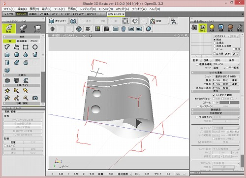
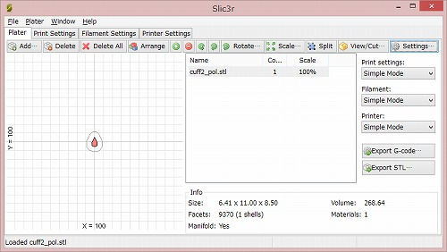
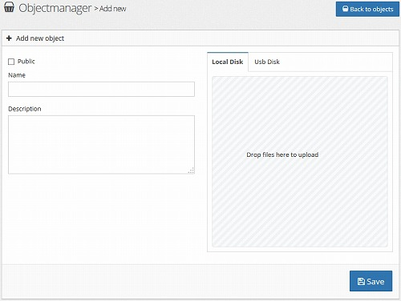
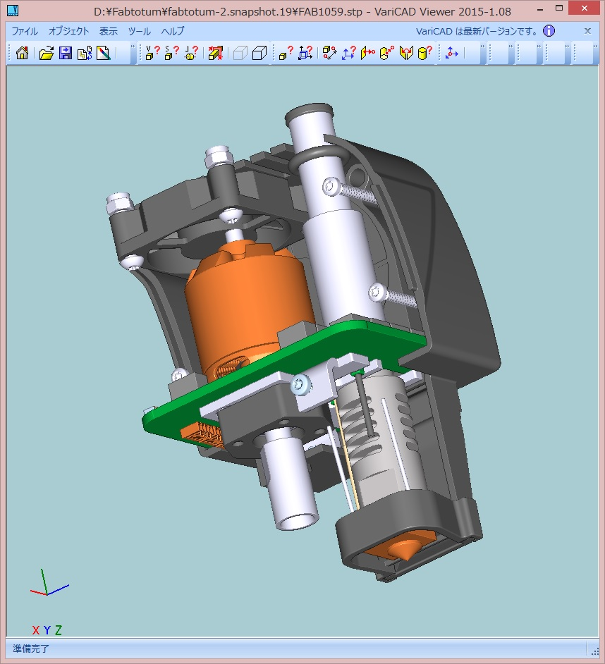
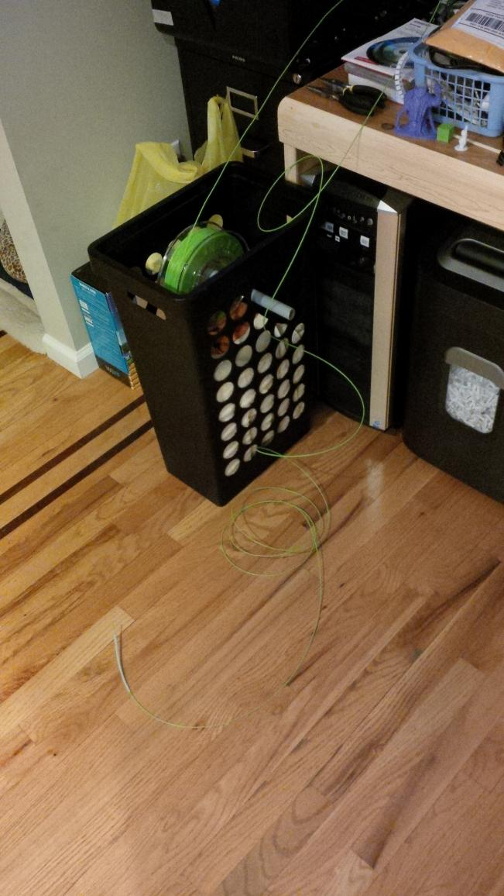

// このエントリは再構築されました

# 概要

Fabtotumが到着してからいろいろと探し回って集めたり、試した情報のまとめ。

# プリントの流れ

私が行っている、3Dデータの作成からプリントまでの流れは以下の通り。

適当なモデリングソフトでSTLファイルを作成 

[slic3r](http://slic3r.org/) でSTLファイルをG-Codeファイルに変換

Objectmanager -> Add new でファイルをアップロード 

あとは Create すれば完成です。

これだけ見れば書くのは容易いのですが、一番のキモは slic3r の設定になるかと思います。Fabtotum 内にある
/var/www/fabui/slic3r/configs の設定ファイルを参考に Configuration Wizard
から以下の通り設定したところ動きました。

Firmware Type : RepRap  
Bed Size : 210x234  
Nozzle Diameter 0.35  
Filament Diameter : 1.75  
Extrusion Temperature : 210  
Bed Temperature : 75

補足：  
Fabtotum に ssh ログインする際のユーザー名とデフォルトパスワードは以下の通り  
(User, Password) : (pi, fabtotum), (root, fabtotum)

# PLAとABSどちらを使うべきか

(私はABSを使ったことがないのですが)PLAが良いと思います。 PLAは融点が低く、熱収縮もほとんどなく、プリントしやすいというメリットがあり、ABSはプ
リント品をやすりがけしたり、アセトンで溶かしたりといったことがしやすいというメリットがあります。
そこで、PLAの後処理をやりやすくすることと、ABSのプリント条件出しするのとを比べた場合に現状では前者の方が分があるように思えます。

また、FabtotumでABSを使う場合は [Linux工作室](http://penguin.tantin.jp/hard/FABtotum.html)
の情報が参考になると思います。

# PLAはどのくらい堅いのか

実際にPLAをやすりがけしてみたところ、
600番でやすっても(削れはするのですが)なかなか積層痕を消すことができず、レジンと比較してかなり大変という印象を持ちました。
積層痕を完全に消したい場合にはエポキシパテで表面処理をするとか 3Dプリンター用コート剤※を使うなどする必要がありそうです。

※[モデリングコート(アルテコ)](http://www.alteco.co.jp/products/pro/#pro05)

# レイヤーの厚みはいくつにすべきか

同じモデルを 0.1mm と 0.2mm でプリントしてみたのですが、 出力時間はあまり変わらない一方で、デキは 0.1mm の方が良いという印象です。
0.1mm と 0.2mm の積層痕の差は目で見ても分かるレベルで、 爪で引っ掻いた感覚でも明確な違いがありました。 また、薄い部分の成形精度も 0.1mm
の方が高くできそうです。 ただ、下部2mmの成形精度だけは 0.2mm の方が綺麗に出来ました。
おそらくベッドとエクストルーダの温度の問題だと思うので、このあたりは条件出しが必要そうです。

# スライサーを変えてみる

3DプリントではSTLファイルをgcodeに変換する処理が必要になるのですが、 この処理を行うのがスライサーと呼ばれるプログラムになります。
FABtotumの動作を確認するにあたり [Slic3r](http://slic3r.org/) というスライサーを使用したのですが
他にも以下のようなプログラムがあります。

  * [Cura](https://software.ultimaker.com/)
  * [KISSlicer](http://www.kisslicer.com/)
  * [Skeinforge](http://reprap.org/wiki/Skeinforge)
  * [Simplify3D](https://www.simplify3d.com/)

Feederのトラブルはフィラメント吐出の癖にも 影響を受けるかと思い、Cura と KISSlicer を試してみました。
が、適当に設定したところ、Cura はフィラメントが吐出できない＆ベッド(Z軸)が動かず、 KISSlicer
はエクストルーダが動かず全くプリントできませんでした。

そんなわけで FABtotum の 対応gcodeリスト(以下参考リンク) を調べて、 各スライサーソフトが出力した gcode
ファイルをテキストエディタで開いて いろいろ見比べてみたのですが、どうも非対応コマンドが並んでいました。

このあたりが怪しそうなので 詳細を追ってみたいと思うのですが、フィーダの問題に関しては Slic3r
で設定を詰めた方が早そうなので、これ以上の追及は後回しにします。

参考： <http://forum.fabtotum.cc/showthread.php?1364-Supported-Gcodes>

# 最終的に使用しているソフトウェア

3Dプリントに際しては、いくつかのソフトウェアを使用する必要があるのですが、いまのところ私はだいたい以下のソフトウェアでカバーしています。

  * [Shade3D](http://shade3d.jp/)
  * [VariCAD Viewer](http://varicad.add-soft.jp/)
  * [Slic3r](http://slic3r.org/)
  * [GCodeSimulator](http://gcodeprintr.dietzm.de/)

Shadeは個人的な好みで選んだので 代わりに 123D Design でも使っておけば全て無償ソフトで対応できると思います。
実際、(最近使っていませんが) 123D Design もインストールしています。 VariCAD Viewerは Fabtotum の
CADデータ(STEP)を確認するために 使用しているだけなので、ブラックボックスで使うなら不要かもしれません。
ただ、エクストルーダやフィーダの構造を理解して分解・改造などを行うなら なんらかのビューアはあったほうが良いと思います。
Slic3rは鉄板です。GCodeSimulatorに限らずSlic3rを使用するのであれば 、サポートのつき方を確認したりするために なんらかのG-
Codeビューアがあったほうが良いです。

VariCAD Viewerでエクストルーダの中身を見るとこんな感じです 

# ベッドの処理はどうすればよいか

3Dプリントにおいて、1層目のフィラメントをベッドにきちんと食いつかせないと プリント途中に剥がれて残念なことになってしまったりするので、
その対策としてベッドにテープを貼ったり糊を塗ったりします。

私はスティックのりを塗ってから3Dプリントを行い、 終わったらウェットティッシュで拭き取っており、 いまのところそれで問題は起きていません。
テープは糊残りが面倒なのであまり選びたくないと思っていまして、 もしこれで問題が起きたらピットマルチみたいな糊に変えてみようかと考えています。

参考  
コメを噛め 3Dプリンターが喜ぶテープを100円ショップで探す  
<http://www.fumi2kick.com/komekame/archives/2079>

# どのフィラメントを買えばよいか

異常に低品質のフィラメントだと太さが不安定とか、やたら折れやすいとかあるようですが、 基本的には保管環境(温度、湿度)に依存するものだと思います。

私が今使っているのは Amazon で Umemoto LLC (梅本合同会社) が 1.75mm 銀色 PLA 1kg \2,400
として販売していたものなのですが、 一度だけ1m程折れやすい(PLAは基本的に折れにくい)箇所があり、
そこでフィーダがerodeしたことがあった以外は問題ありません。

# スプールはどうやって保持すればよいか

Fabtotumにはフィラメントを格納する領域が狭くて 1kgのフィラメントがそこに納まりません。そんなわけで、
ググったら出てきたフィラメントリールスタンドをプリントして使用しています。 フィーダがerodeしないか心配なんですが、いまのところ問題は起きていません。
適当な棒でぶら下げる方が抵抗を少なくできそうな気がするので、 もし問題が発生したらそういった形に変えることも考えています。

参考  
勝手に修理・気ままに工作 フィラメントリールスタンド(filament spool roller)の製作  
<http://projexam.com/blog/hotall/DIY.php?itemid=208>

# Fabtotumのフォーラムに投稿されていたスプールの保持方法

Fabtotumにはフィラメントを内蔵する領域があるのですが、あまり広くないので1kgのフィラメントを使用するとはみ出してしまいます。そんなときは置き場を確
保する必要があるのですが、仰々しいものを作らないといけないかと勝手に考えていましたので適当なカゴと棒で十分だとは思いもよりませんでした。

元スレ <http://forum.fabtotum.cc/showthread.php?1621-Timeline-after-recieving-my-FABtotum>

