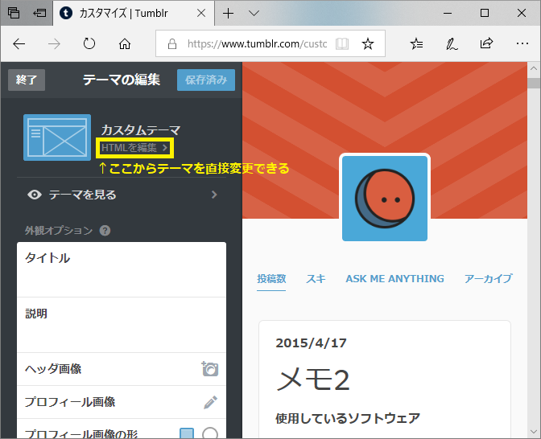

### 概要

ソフトウェア関連の情報なんて古いと価値がなくなったりしますので、 Tumblrの記事に「作成日時」を自動で挿入できるようにテーマを修正しました。
(デフォルトテーマでは非表示になっていました) その手順が分かりにくかったのでここに記録しておきます。

### 手順

  1. Tumblrの管理画面から「テーマの編集」を開いて「HTMLを編集」をクリック (以下参考画像)

  2. posts の部分の Title の前に以下を追加  
**{Year}/{MonthNumber}/{DayOfMonth}**

### 補足

本当はちゃんと以下を読んで理解してカスタムすべきですが、今回は日時を表示させたいだけだったのでズルしてます。

**カスタムHTMLテーマを作成するには**  
<https://www.tumblr.com/docs/ja/custom_themes>
