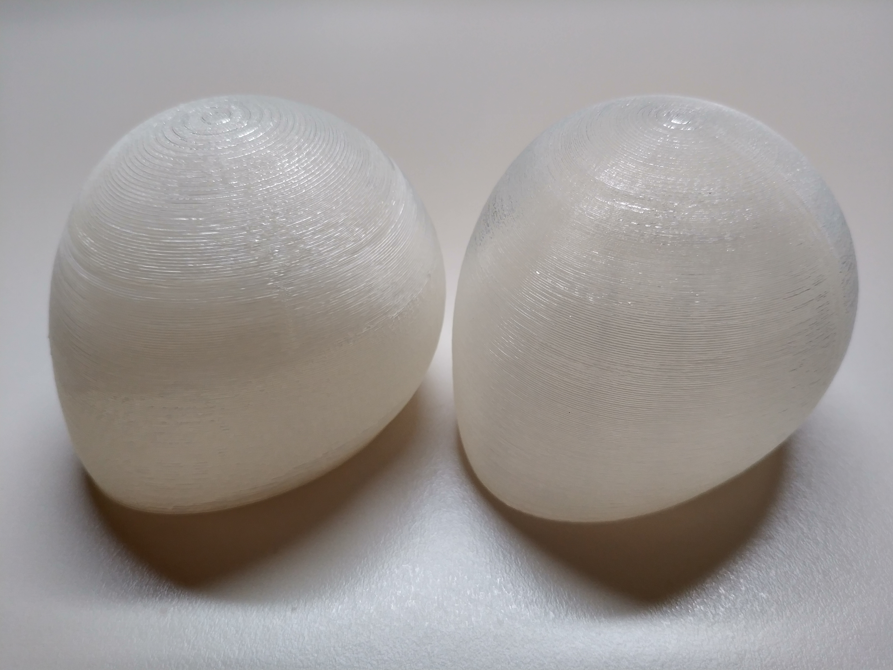

### 概要

組み立て式の格安3Dプリンタ Anet A8 (Reprap) の組み立てノウハウのまとめ。
ちゃんと調整すれば10万円超のプリンタにも負けないくらいの精度でプリントできる割に
適当に組み立てるとガタガタなものしかプリントできないので、私が行った調整を記録。

### 背景

今は Anet A8 という組み立て式の3Dプリンター(特売で1万5千円くらい)を使っているのですが、
Web検索すると記事が数多くヒットするものの、本体の組み立て精度が悪いのか造形サンプルが酷いものが目につくので
私が精度を出すのに調整した内容を記録しておこうと考えました。

### 準備

まず最低限の精度を出すために以下が必要になりました。

  * Anet A8 キット
  * **ゴム製の柔らかいタイミングベルト** (500円くらい)
  * シリコーン系**グリス** (300円くらい)

**※最低限の精度**: 私の経験では 1/1000mm 単位の調整は職人芸、1/100mm 単位の調整は慣れ、1/10mm 単位は目視できるという感覚があるのですが、 造形物を見たときに(機械的な誤差に起因する)アラが目立たない程度を想定しています。

### 組み立て

microSDカードに保存されているPDFマニュアルと公式の組み立て動画を参考に組み立てました。

<https://www.youtube.com/watch?v=EB5Q3_sJ-Tk>

標準のベルトを動作確認に使ったところ、硬過ぎるようで造形精度が出なかったので(造形物の表面にベルト周期の波打ちが表れたので)ベルトを交換しました。また、リニ
アベアリングに塗布するために手持ちのグリス使いました。

注意点としては以下のとおり

  * リニアベアリングにグリスを塗布
  * 標準のベルトを使わない
  * 複数点で固定するものは仮締めしてから(可動部ならさらに滑らかに動作することを確認して)増し締めで固定

### 調整

精度の悪い部品が混ざっていたりしなければ、組み立てをちゃんとするだけでそれなりの精度が出ると思います。 テストプリントしてみて**造形物の表面に周期的なうね
りや再現性のあるズレが発生する場合は組み立て調整で改善する可能性が高い**ので怪しそうなところのネジを緩めて締めなおすと良いです。あと私は2つあるZ軸の高さ
微調整もやりましたが、Z軸はそもそも誤差が認識しにくいので、おそらくやらなくても目立たないと思います。

なお、エラーの"周期"は原因となる部品の周期に一致していることが多いのでベルトのギザギザ周期やモータの回転周期なんかを確認すると経験上解決が早いです。また原
因が複数あると"うなり"になって表れたりもします。

さらに追加で以下のようなオプションを取り付けましたが、ベルトのテンションは一度決めたらほとんど調整していません。ただし、私の個体ではY軸ベルトが斜めにかかっ
てしまっていたので、そこの微調整は行いました。なお、Y軸用冶具は(コメント欄にあるように)ネジを95%くらいに縮小印刷しないとキツくて入らないかもしれません

  * X軸ベルトのテンション調整冶具 (<https://www.thingiverse.com/thing:1683070>)
  * Y軸ベルトのテンション調整冶具 (<https://www.thingiverse.com/thing:2149867>)
  * Z軸用のキャップ (<https://www.thingiverse.com/thing:2025343>)

だいたいこれで問題なく造形できます。精度向上のために追加冶具をゴテゴテつけたり、金属パーツの3Dプリンタを組み立てたりとかいう方法もありますが、私としては*
*ハズレ部品を交換して組み立て精度追い込むだけで十分な精度は出る**と思います。

### 造形サンプル

実際に以下が造形サンプルになります。手元に調整前後の写真がなかったので、同じ3Dモデルを"スライサー違い"(Simplify3D(左) と KiSSlice
r(右))で印刷したものです。組み立て精度を詰めると今度はソフトウェアやパラメタの差、場合によっては3Dデータの分割時のアラが見えるようになります。

なお、これ以上は泥沼化の匂いがしてきたのでここでやめました。 スライサーは Slic3r、KiSSlicer、Simplify3D
の3種を使ってみましたが、基本は Simplify3D、必要に応じて KiSSlicer を使い分けています。よく言われるように Simplify3D
は優秀なのですが、万能ではないので、実際のところ KiSSlicer の方が綺麗に造形できることもあります。

