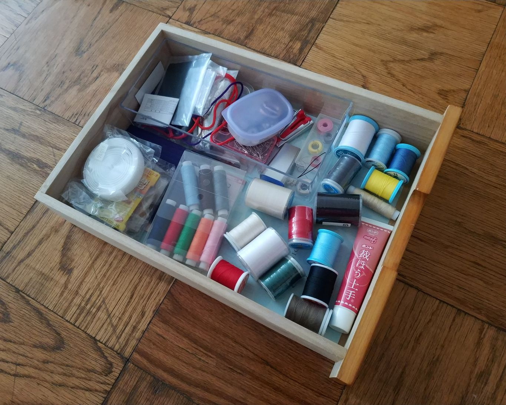
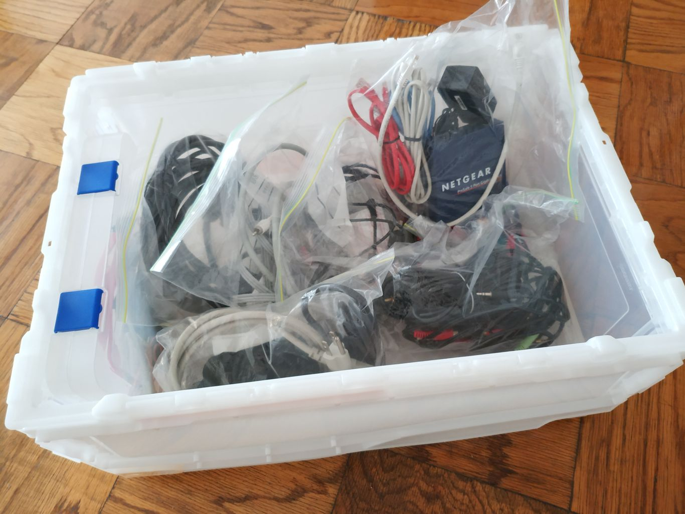

## 概要

断捨離やこんまりメソッドなど物を捨てる方法論は流行ったけれど、オタクのコレクションを捨てずにかつ上手に収納するってのはあまり聞かないと思ったので、私自身の1
0年以上に及ぶ一人暮らしから得た収納に関する知見についてのまとめ。

## はじめに

収納に関して検索すると「ごみは捨てろ」という当たり前のことや「この100均グッズが便利」とかいうテクニックは簡単にみつけられるものの「具体的にどんな作業を行
えば部屋が片付けられるか」ということが非常に分かりにくいように感じたので、私が具体的に行っている方法をまとめました。

私自身は特定のジャンルに特化したオタクではなく、漫画も本もゲームソフトもフィギュアもCD・DVDも家電もカメラも模型も自作コスプレも、、、と多種多様な荷物を
抱えるオタクです。そのためこの記事は雑多なものをいかに収納するかという内容で、漫画ばかり大量に所有する人がいかに管理するかという内容ではありません。

## 準備

狭いスペースに大量の荷物を収納するのは管理コストがかかります。私は以前6畳一間のアパートに住んでいたのですが「作業するためには家具を移動させなければならない
」「作業に使う素材を取り出すためには荷物を移動させなければならない」とまるで15ゲームのような状況でした。

あるとき広い部屋に引っ越してみたら作業が思いのほかやり易くなって、メモリの足りないPCにメモリを増設したかのような快適さを感じたことがあります。「痩せたいな
ら見えるところに食べ物を置くな」とはよく言われますが「やりやすい環境を整える」というのは想像以上に作業のハードルを下げる効果があります。

そこで作業のハードルを下げるための収納方法を模索してみたのですが、ズボラな私にとっては「**使いやすい収納スペース（収納力）＞よく使うものの収納に必要なスペ
ース（物量）**」を維持するのが必要だということでした。 要は使わないけど捨てられないものは封印してしまっても問題にならないし、使いにくい収納スペースはあっ
ても片づけられなくなってしまう、そしてそもそも収納スペースが足りなければ絶対に片付かないということです。

だからまずは**収納力**と**物量**をざっくり引っ越し段ボール〇箱分とでも見積もった後、引っ越しや収納用品(後述)の追加導入などで収納力を増やしたり、断
捨離などで物量を減らしてなんとかします。 なお、ここでなんとか「収納力＞物量」にできないなら既に詰んでいるので、ここから先は諦めたほうがいいかもしれません。

## 収納

収納用品は探せばいくらでもみつかりますが、収納に関して言えば専用品を導入するより汎用品を専用化する方が物量の増減に対応しやすいので私は以下5種類の収納用品で
ほとんどの物を収納しています。

  * 本棚
  * 収納棚
  * 薄型引き出し
  * パイプハンガー＋埃避けカバー
  * コンテナ（段ボール）

## 本棚

本、漫画、同人誌、CD、ゲームソフト、フィギュアなど収納＆飾るスペース。絶対に**段の高さを調整できる**もの。 そもそも本棚に重い本をみっちり詰め込むと本
体や床の耐荷重を超える可能性があるので、重くない円盤類やフィギュアなど飾るスペースを混在させて調整。なお、捨てられないが本棚に並べるほどでもないものはコンテ
ナ（段ボール）等で保管。

例えば IKEA のビリー

<https://www.ikea.com/jp/ja/catalog/products/10351568/>

## 収納棚

掃除機、ブラーバ、ミシン、カッティングマシン、カメラ、プリンタ、アイロン、ヘッドマネキン、工具箱、衣類（普段着）など、それなりの体積があって置き場がないと邪
魔なものを垂直方向に収納するスペース。あればクローゼット備え付けの棚でも可。カラーボックスでも可。

## パイプハンガー＋埃避けカバー

衣類をかけたまま収納するスペース。クローゼットで足りるなら不要。コスプレなんかが趣味だと足りなくなるので必要。安物はパイプが細くて強度が低いので要確認。

## 薄型引き出し

書類から日用品、旅行用品、洋裁小物、メイク道具、電子部品、模型用品など小物ツール類なんでも収納スペース。

例えば アイリスオーヤマのスーパークリアチェスト

<https://www.google.com/search?q=%E3%82%B9%E3%83%BC%E3%83%91%E3%83%BC%E3%82%AF
%E3%83%AA%E3%82%A2%E3%83%81%E3%82%A7%E3%82%B9%E3%83%88>

## コンテナ（段ボール）

不定形のモノを入れて積める箱。コスプレ製作用の布や素材のストック、シーズンオフの衣類、スポーツ用品、自作PCパーツ、作業途中のモノから捨てられないモノまで。
引き出しなどと異なり、上の箱をどけないと下の箱が取り出せないので原則的に**開封頻度が年数回以下のもの**の収納以外には使わない。作業途中のモノは最上段に積
んで終わったら空ける。中身が何か分からなくなりがちなら半透明のコンテナが便利。

例えば トラスコ中山のスケルコン

<https://www.google.com/search?q=%E3%82%B9%E3%82%B1%E3%83%AB%E3%82%B3%E3%83%B3
>

## 実例

## 本棚

本体はIKEAのビリーに棚を追加したもので、金の水玉模様はそういうシートを貼っています。下段に重い本を配置し、中段は飾るスペース、上段は軽い漫画やゲームソフ
トなど。中上段に**仮置き場（積読置き場）を用意して、買ってきたものはここへ置き、読み終わったり適当なタイミングで移動**しています。空いているように見えま
すが、詰めると物が床に溢れるので、意図して空けています。 

## 薄型引き出し

洋裁関連の小物はとりあえず引き出しに突っ込んでおき、必要な時は**引き出しごと作業スペースへ持っていきます**。この程度のスペースであれば物をなくしてもみつ
けられるので整理は適当です。（きれいに整頓しても維持できないので、作業効率が落ちない程度に手を抜いています）

## コンテナ

絡まりやすいケーブル類は種類ごとにジッパー付きビニール袋にまとめてからコンテナに入れています。なお、この中にあるケーブルは多くても年に数回しか使わないような
ものばかりで、頻繁に使うケーブルは使用場所近くに置いています。 

