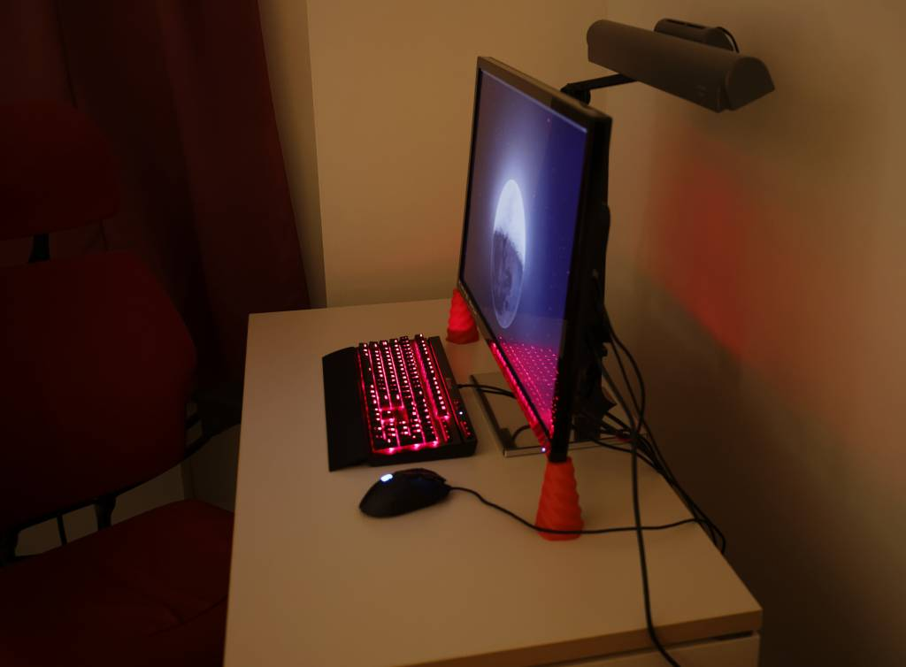
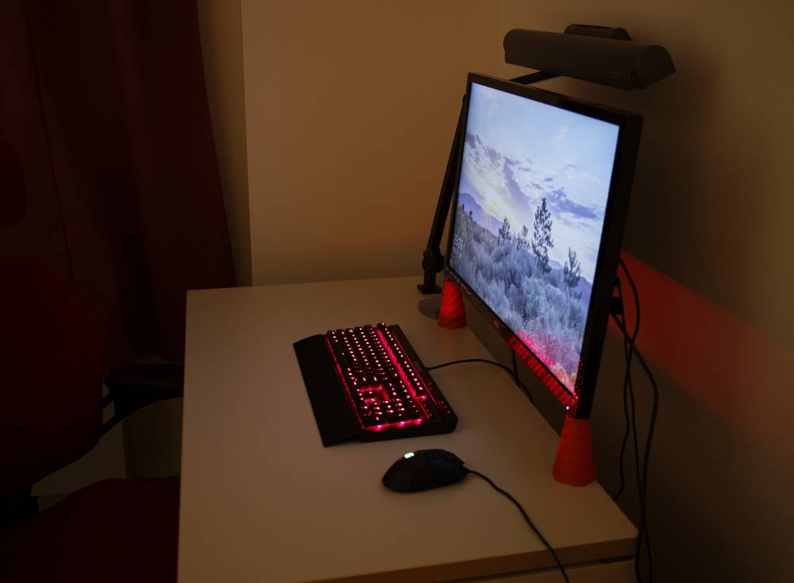
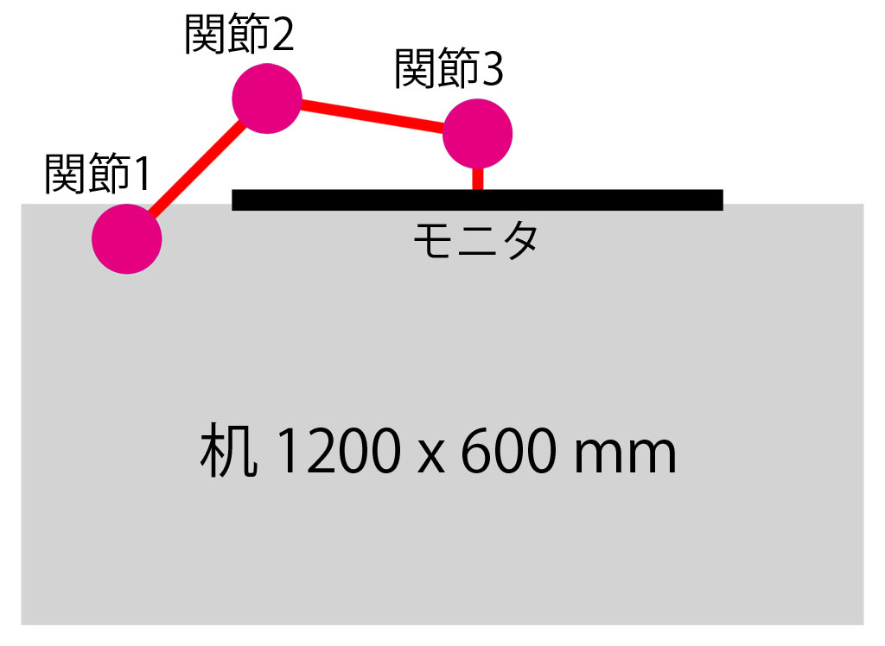

## 概要

ノーブランドのモニターアームを導入したのでその記録

## ログ

32インチモニタを導入してから机の奥行きの短さが気になっていたので、モニターアームを使って奥行きを稼ぎました。(写真は導入前と導入後、画像は上から見た配置)

モニターアームを使うとモニターの下のスペースが使いやすくなるというメリットをよく聞きますが、モニターアームを机からオーバーハングさせて、机の奥行きを稼げるっ
てのも大きなメリットです。(ただし構造上それができないモニターアームもかなりあります)
もちろんオーバーハング分は机と壁との間にスペースが必要なのですが、PCを使うなら配線関係で少しスペースを空けるのが常なのでやりようはあるかと思います。

あと、取付で気になった点は以下の通り。

  * 机の幕板がクランプのハンドルに干渉して回せない (机は fantoni GF 1200x600mm)
  * クイックリリースにあそびがあって水平がでない (詰め物が必要かも、レビューに記載あり)
  * チルトが微妙でおじぎする (モニターが過重許容上限近くだからかも、レビューに記載あり)

