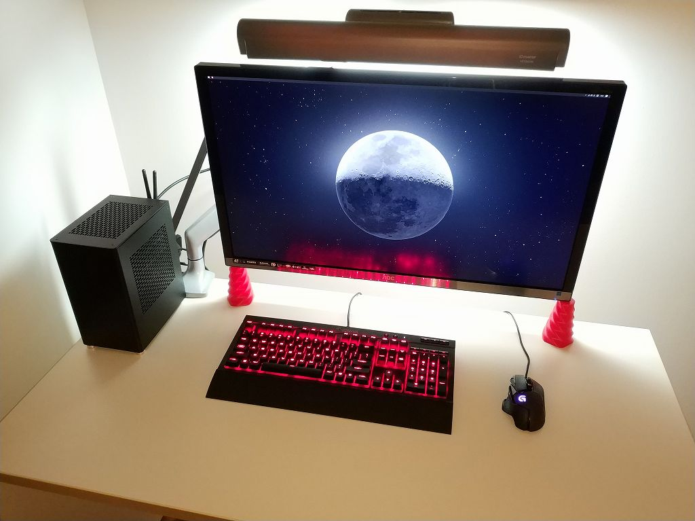
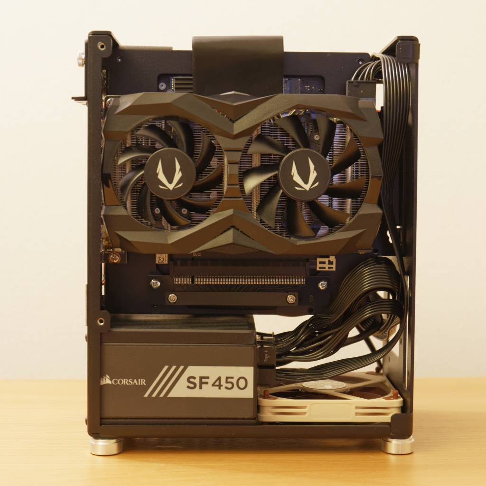
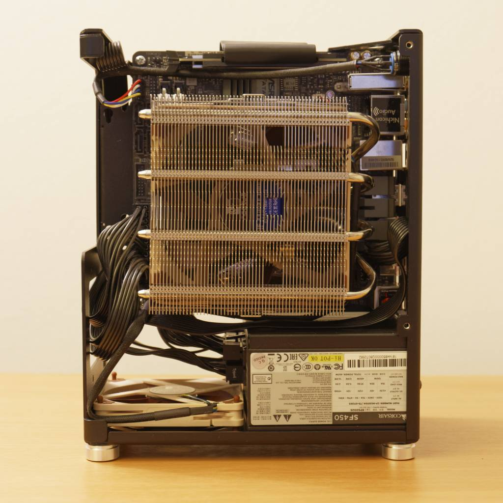
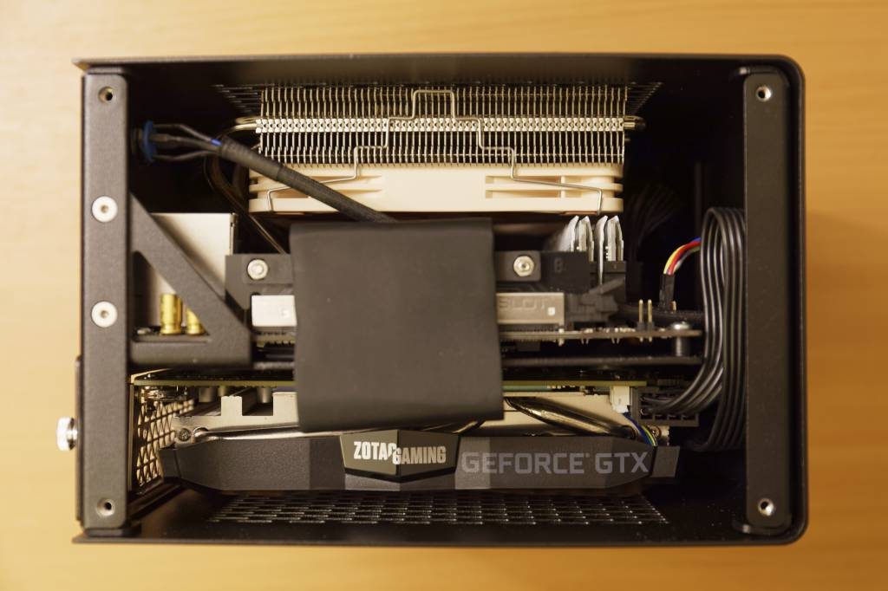
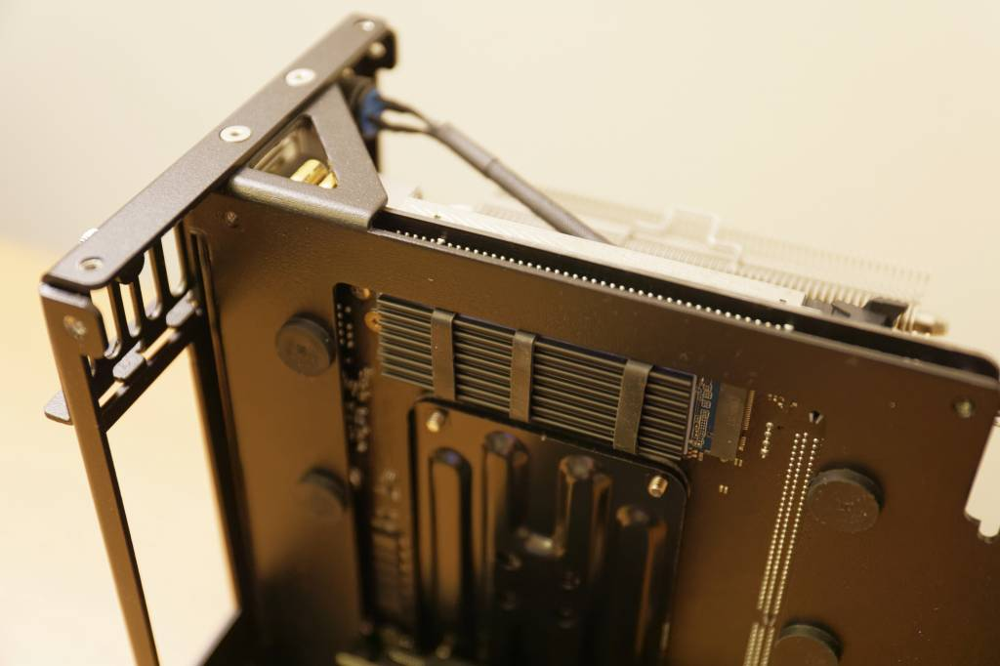
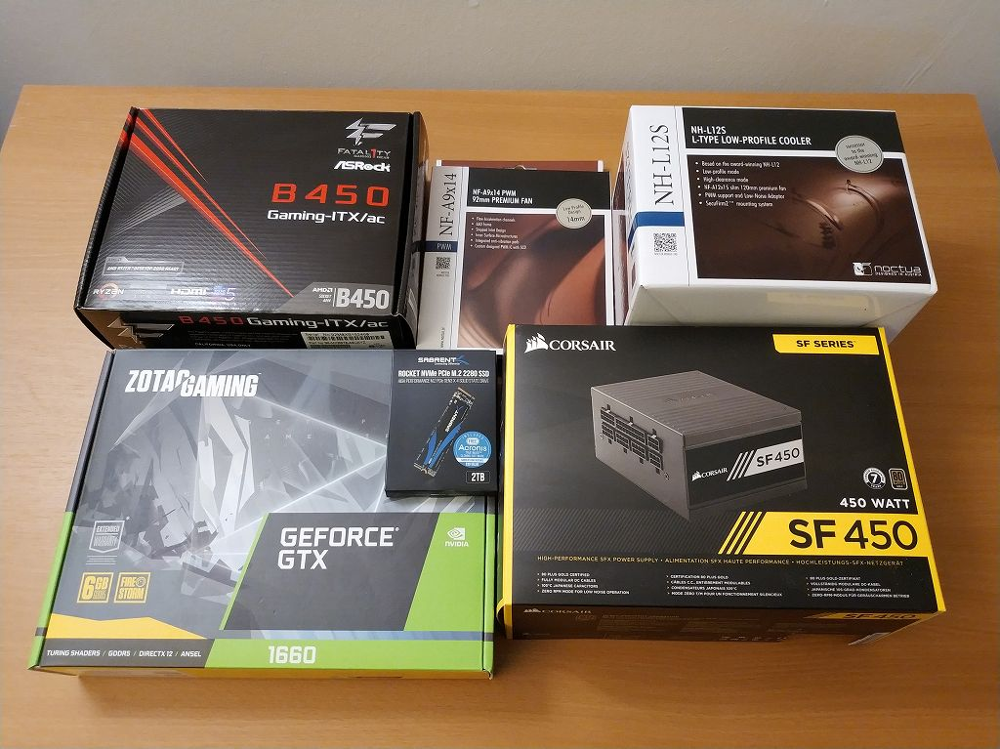
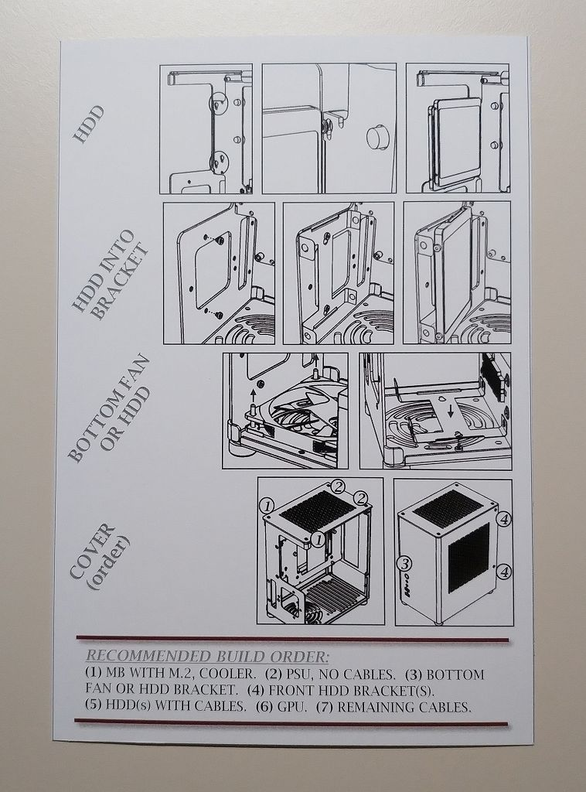
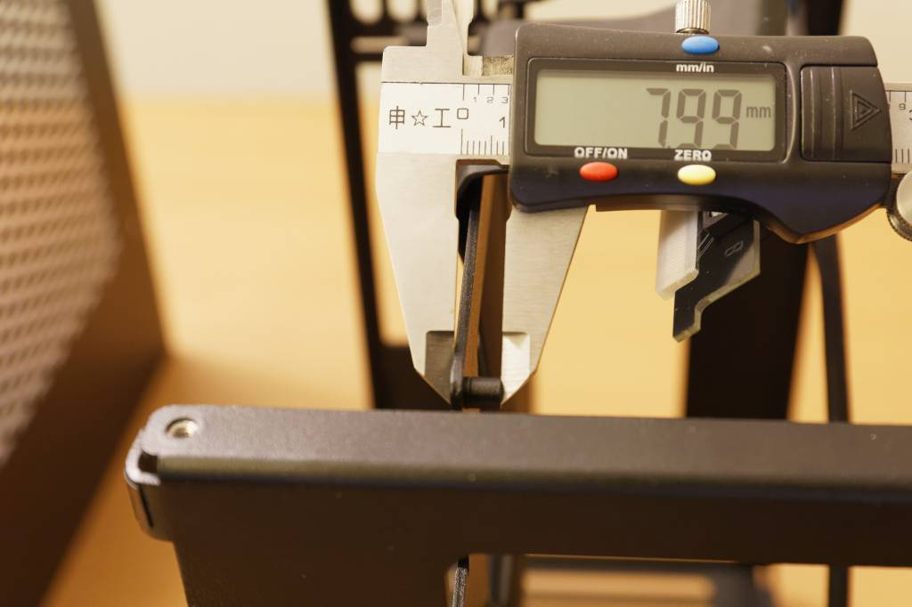

# 概要

Case-by-Case Design (<https://www.casebycasedesign.com>) の MI-6 Second Edition
で小型PCを組み立てたのでその記録

# 背景

10年以上フルタワーを使ってきたのですが、もうGPU以外拡張スロットを使わなくなったので、MI-6 を購入して机に置ける小型PCに組み替えました。

小型PCはケース選びが重要で「小型だけど冷却設計がいまいち」「体積は小さいけどフットプリントは広い」「長いGPUを積める設計のため奥行きが長過ぎる」など、何
かしら妥協点を抱えたものが多いなか、MI-6 は冷却性能、フットプリント、奥行きの3点で私が求める要求を全て満たしていました。

# サイズ感

MI-6 のサイズは 135W x 203D x 246H mm なので 1200 x 600 mm の机に置いて邪魔にならない程度にはコンパクトです。

# 内部構成

写真のようにみっちり詰まっています。

パーツは以下の通り。(写真はCPU/メモリ含まず)

  * CPU: Ryzen 5 3600
  * CPUクーラー: Noctua NH-L12S
  * M/B: ASRock Fatal1ty B450 Gaming-ITX/ac
  * メモリ: Ballistix Sport LT DDR4-3200 16GBx2
  * SSD: Sabrent Rocket 2TB
  * GPU: Zotac GeForce GTX 1660 Twin
  * 電源: Corsair SF450
  * ケースファン: Noctua NF-A9x14

## メモ

  * CPU は Ryzen 9 3900X にしようかと考えましたが、普段使いのアプリケーションが最大4コアまでの対応だったので Ryzen 5 3600 としました。もし 3900X を積むなら騒音を抑えるために電圧オフセット -0.1V した方がいいかもしれません。

  * MI-6 の CPUクーラー高さ許容は 68mm ですが、実力で Noctua NH-L12S (高さ70mm) が搭載できます。米国では NH-L12S が $50 で買えるのでこれが鉄板です。まぁ、ケースはたわむんですが。 Bequiet! の Shadow Rock LP (要ファン変更)や サイズ の 大手裏剣参 などもアリかと思います。

  * M/B は適当に安いのを選んだのですが USB周りのトラブル以外は経験していません。MI-6 では M/B 背面部分がくり抜かれているので GPU を外すだけで M.2 にアクセスできるのと、ヒートシンクをつけられるので 背面M.2 でも使いやすさの点で問題はありません。 むしろ CPUクーラー を外さないとアクセスできない 表面 M.2 の方が使いにくいかもしれません。なお、Webページに くり抜き部分と背面 M.2 の位置関係に関する資料があります。

  * メモリは CPUクーラーに合わせてヒートシンクの低いものにしています。普通のDDR4の基板高さは 31.25mm、Ballistix Sport LT ヒートスプレッダ込の高さは 32.5mm、NH-L12Sの許容最大メモリ高さは 33mm でなんとか入ります。

  * SSD は Phison E12S 搭載品。SSD は劣化して速度低下するので容量多い方が劣化するまでの時間を稼げると考えて2TB品を選択しました。ついでに150円くらいのヒートシンクもつけています。

  * GPU は GTX1660Ti と迷って 1660無印にしました。RTX2070クラス を載せるのはロマンなんですが、消費電力が増えると騒音も増えるので 1660Ti (TDP120W) くらいが妙味だと思います。 Zotac のを選んだのは DP x3 HDMI x1 だからです。なお、GPUの最大長さは 188mm ですが、実力はもう少しありそうです。それでも Zotac の AMP (209.6mm) は載りません。(ケースの奥行は203mmです) また、バックプレート付きのGPUを搭載する際は保護用のゴムを外す必要があるかもしれません。

  * 電源も鉄板の Corsair SFシリーズ。M/B電源、GPU補助電源のみ使用なのでモジュラータイプが便利です。SilverStone の電源はコネクタが干渉したとかいう報告があったような気がします。

  * ケースファンも鉄板の Noctua NF-A9x14。ケースファンの有無で冷却性能が大きく変わる実験結果(詳細は公式ページ)があるので基本的に必須です。また電源コネクタと干渉しないように低背のものが推奨されています。

# そのほか

  * 小型PCは組み立てに難儀することが多いと言われますが、MI-6 に付帯の推奨手順書に沿って作業すれば難しくありませんでした。ケーブルが少なかったのが難しくなかった理由かもしれません。

  * 体感でアイドル時の騒音は 3.5" HDD よりも静かなくらい、負荷時の騒音はそれなり(ノートパソコンや水銀灯プロジェクターのファンノイズよりもマシな程度)でした。十分な冷却性能を鑑みれば許容範囲です。

  * MI-6 の天面に物を置くことは考慮されていません。また、天面の穴が大きいので金属のクリップなど落とすと事故の可能性があります。

  * より長い奥行を許容できるなら Nouvolo Steck など他のPCケースもあります。

  * M/B背面クリアランスは約8mmです。

