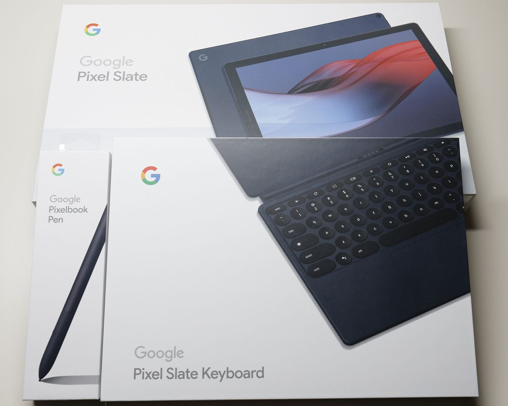

# 概要

初めての Chrome OS 端末として Pixel Slate を買ったので簡単な記録。

# 背景

2019年のブラックフライデー特価で 本体($799)＋キーボード($199)＋ペン($99) のセットが $449 +tax になっていたのを買った次第。

# スペック

## Pixel Slate

  * CPU : m3-8100Y
  * RAM : 8GB
  * Storate : 64GB eMMC
  * 画面サイズ : 12.3"
  * 解像度 : 3000x2000 (293ppi)
  * サイズ : 202 x 291 x 7 [mm]
  * 重量 : 731 [g]

## Pixelbook Pen

  * 筆圧分解能 : 2000+ (2048?)
  * 遅延 : 10ms
  * 電池が特殊 (AAAA)

## Pixel Slate Keyboard

  * 独自コネクタ (USB?)
  * カバー・スタンド兼用
  * 重量 : 486 [g]

# 感想

デジタルノート端末としては超優秀。でも(金積めて)デジタルノート以外の機能も求めるなら iPad Pro ($1200) をどうぞ。

# その他コメント

  * 結構重い、ずっしり感がある
  * キーボードはペコペコしない
  * キーボードのボタンが少ないのは慣れない 
    * Home, PageUp, PageDown とかなかったり
    * ファンクションが同時押しだったり
    * Alt + F4 が効かないアプリがあったり
  * キーボードのスタンド機能はかなり安定している 
    * マグネットがかなり強力
  * タッチパッドは良好
  * Linux (ターミナル) はすぐに使えるようにできる 
    * apt-get が使えるのでかなり簡単
    * gentoo ベースらしい
    * VSCode とかも(ダウンロード時間除いて)10分あれば入る
  * Android アプリは問題なく動く印象
  * Linux アプリはちょっと怪しいかもしれない
  * Google Keep または Squid ならペンの遅延は気にならない 
    * ただしペン入力予測による仮想的な遅延なので描画がピョコピョコ修正かかる
    * Google Keep はクセがあるので個人的には Squid が好き
    * Squid は無償でも十分使える、バリバリ使うなら課金する価値あり
  * 遅延の気にならないお絵描きアプリは不明 
    * アイビスペイントで 150+ ms くらい
    * Cintiq Pro は 100 ms 以下という話
    * 解像度が高いから遅延が大きいのかもしれない
    * メディバンペイントはアイビスペイントよりも遅延が大きい
    * Krita は遅延も大きく、不安定で筆圧検知もできない
  * 視差は気にならない
  * オフラインでもそれなりに使える
  * ゲストモードは使えない(ブラウザしか使えない)

