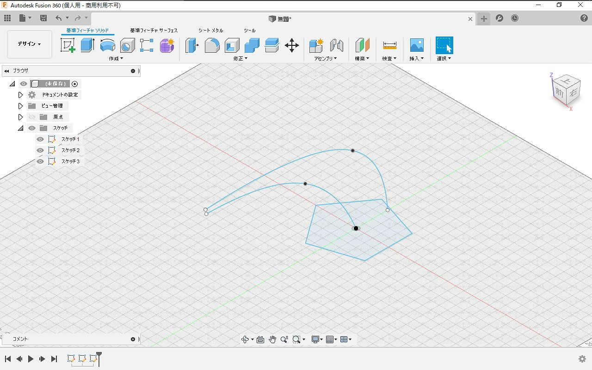
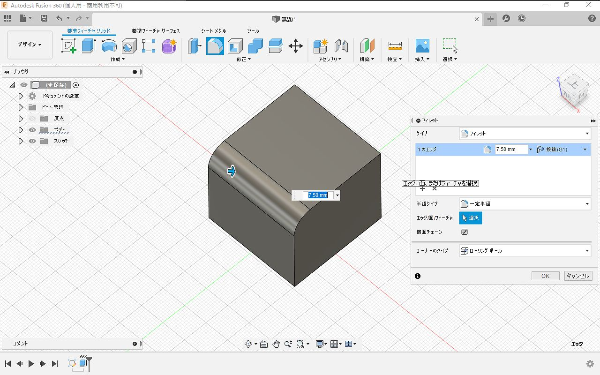
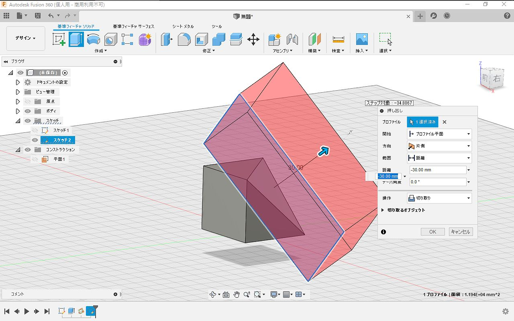

# 概要

個人非商用なら無償で使える Fusion 360 という 3DCAD
アプリケーションがあります。結構便利なんですが、機能が多過ぎて最低限必要なところが分かりにくいと感じたので、これだけ覚えればなんとかなる機能をまとめました。

# メニュー

Fusion 360 では以下のようにメニューが呼び出せます。

最低限以下の項目(画像で矢印のついた項目)を覚えればなんとかなります。

  * スケッチを作成
  * 押し出し
  * 回転
  * スイープ
  * ミラー
  * フィレット
  * 面取り
  * シェル
  * 結合
  * 移動／コピー
  * 削除
  * 3点を通過する平面
  * STL形式で保存

# 必須機能

## スケッチを作成

平面を選んで、選んだ平面上に基準となる図形を作図します。 操作自体は難しくないのですが2点ほど知っておくべきことがあります。

1つ目は **奥行方向に意図せず位置がずれる**ことがあります。
そもそも2次元のインタフェースで完全な3次元の操作は不可能なので、3次元方向のスケッチを作成したい場合は
画像のような2次元視点でスケッチを完成させてから点なり線なりを移動ツールを使って平行移動させるのが確実です。

2つ目は**意図しない自動拘束**のせいで操作が効かなくなることがあります。 3DCADツールには拘束という機能があり、
例えば角を常に直角にしたり、辺の長さを固定して、 スケッチを修正した際に拘束した箇所を自動で追従させることができます。

Fusion 360 はこの拘束を自動で追加する機能があり、設定で無効化することもできません。 特に原点基準でスケッチを描くと、原点拘束がついて
移動させようとしても(エラーメッセージも何も出ずに)移動できないといったことが起きたりします。

拘束の外し方やどんな拘束が効いているか確認するのは分かりにくいので、 もし操作が効かなくなったら、スケッチを削除して作り直す方が経験上早いです。

## 押し出し(＆切り取り)

描いたスケッチを元にボディ(立体)を作ったり、ボディを削ったりする機能が押し出しです。 スケッチの選択した部分に対して押し出しできます。

また、スケッチはボディにも作成できるので、押し出したボディに横から穴をあけるといったことができます。

## 回転

回転ではスケッチを指定の軸に対して回転させてボディを作ることができます。

## スイープ

スイープは3次元のパスに沿って押し出す機能です。押し出しや回転ではできない曲がったものを作ることができます。

さらにスイープを行う際にガイドレール(補助線)を追加すると、スイープしながら大きさを変えたりねじったりすることもできます。

## フィレット・面取り・シェル

フィレットは角に丸みをつける、面取りは角を切り落とす、シェルは中をくり抜く機能です。

## 平面の作成

スケッチを斜めの平面に作りたい、斜めで切り落としたいといったときは **3点を通過する平面**を定義して押し出しカットすればできます。

## ミラー

左右対称の形を作りたいときはミラー機能を使うと対称に複製できます。

## STL形式で保存

3Dモデルを3Dプリントできる形式(STL)で出力するには**STL形式で保存**を呼び出せばよいのですが、
ミラーを使った後のようにボディが複数ある場合は**結合**してから**STL形式で出力**してください。

結合しないで出力するとスライサーがボディを別体だと認識してしまうため ミラー面で割れたり出力品質が下がったりする可能性があります。

# 最後に

Fusion 360 では特定のモードでしか表示されないメニューが結構あるので メニューがみつからないときは、違うモードに切り替わっている可能性があります。

Fusion 360 ではスカルプトという機能を使って曲線の多い形状も作ることができるのですが、 慣れないと操作が難しいのでお勧めしません。
