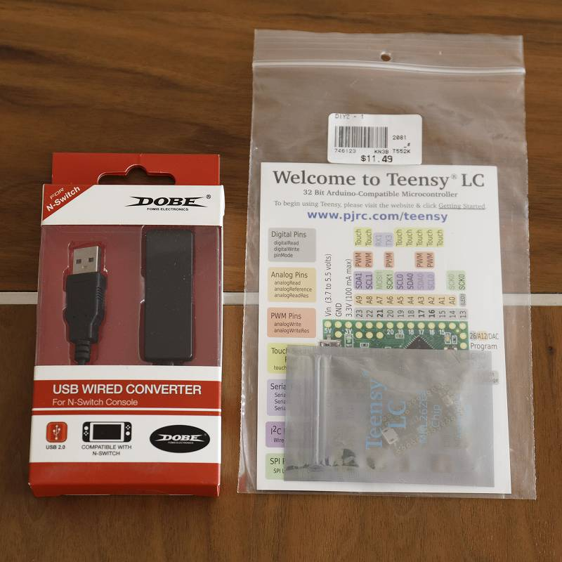
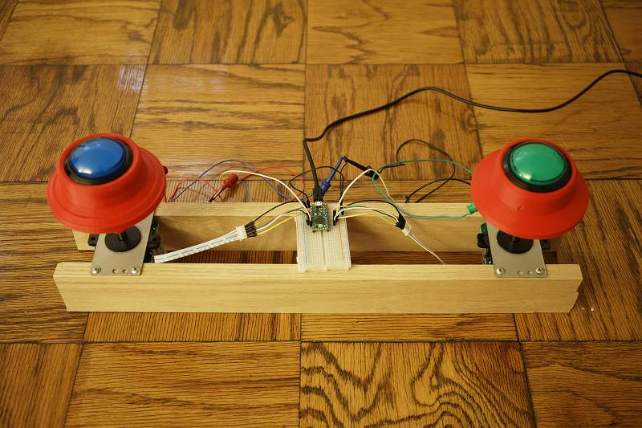

# 概要

Nintendo Switch の グルーヴコースター ワイワイパーティ のためにコントローラ(BOOSTER)を自作したのでその記録

# はじめに

グルーヴコースターの専用コントローラは自作するのが定石のようで、 検索してみるといろいろと見つけることができます。
しかし検索してみつかるもののほとんどはPC(Steam)版を対象としており、 Nintendo Switch
は普通のUSBコントローラを受け付けないのでそのままでは使用することができません。 いろいろ試してみた結果、以下を組み合わせて Nintendo
Switch で動作させることに成功しました。

  * BOOSTERの機構、電気回路、および Teensy 用スケッチ <https://github.com/vikbez/groovecoastercontroller>

  * Teensy を X-Input コントローラとして動作させるためのライブラリ <https://github.com/topics/xinput-controller>

  * DOBEアダプタと Teensy LC

※DOBEアダプタ：X-Input のコントローラを N-Switch に Proコンとして認識させるアダプタ

# 完成品

はんだ付けは面倒だったので省略。

# 補足

基本的に bikbez 氏の設計に沿って作りましたが以下の点を変更しています。

  * ボタンはフラット型、ドーム型試してドーム型にしました
  * ボタンの反響音を抑えるために分解してスポンジを挟みました
  * レバーの長さに合わせて"お椀"の曲率を調整しました
  * レバーのスプリングは固いもの(1lb->4lb)に交換しました(標準だと軽過ぎた)
  * レバーのシャフト接続部分には M6 のインサートナットを使いました(がたつきを抑えるため)
  * ベニヤを用意するのが面倒だったので手元にあった 1x3 の木材を使用しました
  * ボタンの LED は光りません(回路を組むのが面倒だったので)
  * マイクロスイッチが標準では重い(200g？)ので軽いものに交換予定

マイコンで N-Switch
用コントローラを実装することも考えたのですが1週間くらいかかりそうだと感じたのと、DOBEアダプタの遅延が問題なかったので行っていません。

# そのほか参考

* 自製GrooveCoaster控制器 <http://knuckleslee.blogspot.com/2018/04/groovecoaster.html>
* GROOVE COASTER 4(グルーヴコースター) 自宅購入 + 後期加工 <https://kokoa-love.blogspot.com/2018/12/groove-coaster-4.html>
* Groove Coaster PC Controller [PART 1: Booster Hardware] <https://www.instructables.com/id/Groove-Coaster-PC-Controller-PART-1-Booster-Hardwa/>
* TinyBooster <https://pls.booth.pm>

