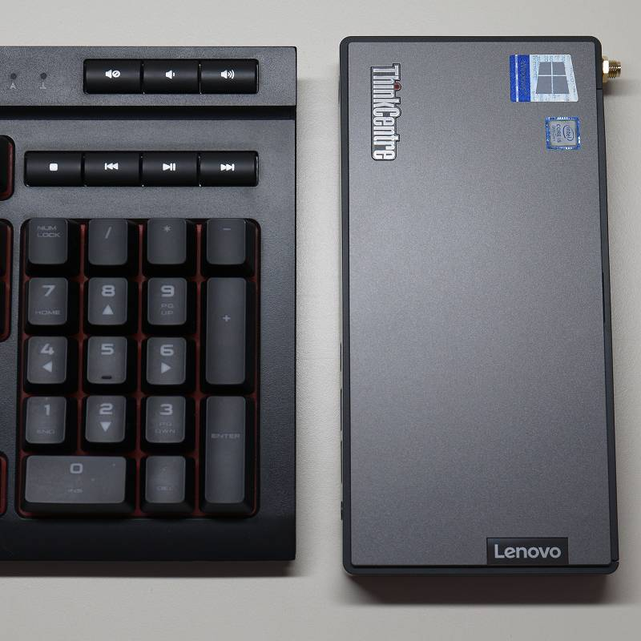
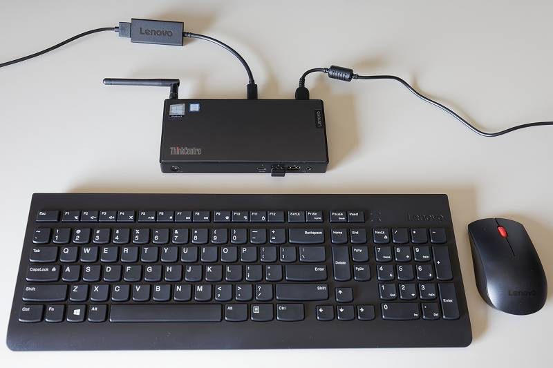

# 概要

Lenovo ThinkCentre M90n Nano を買っていろいろ調べたまとめ

# 背景

昨年暮れに NAS を導入して便利に使っていたのですが、Syncthing
の同期対象ファイル数を10万以上に増やしたところ使い物にならないくらい遅くなってしまいまして もうちょっと性能が欲しいと思っていたところ Lenovo の
Cyber Monday in July というセールで ThinkCentre M90n Nano がいい感じだったので買ってしまいました。

// NAS を使った感じから 1Gbps
の帯域は十分だけど、ランダムアクセス速度はもっと欲しい(CPU性能とSSDが必要)と感じていたので希望通りのものでした。 また、10Gイーサ搭載の QNAP
TBS-453DX はオーバースペック過ぎる気がして躊躇していました。

# 特徴

ThinkCentre M90n Nano
はノートパソコンから液晶・キーボード・バッテリをとっぱらったような感じで、サイズはテンキーくらいの大きさ(179x88x22mm)です。
その割にノートパソコンらしからぬ以下の特徴がありまして、ちょうど NAS 兼メディアプレーヤーにぴったりな感じでした。

  * SSD用 M.2 スロットx2 (RAID可)
  * Ubuntu 動作確認済み
  * ファンレス仕様も選択可能

もちろんアイドル時の消費電力は低い(4.7W)ですし、Samsung 製 512GB NVMe SSD 搭載で $399 (さらに 8% キャッシュバック)
と信じられない価格でした。

// 産業用途を想定したファンレスモデル主導で設計されたものを事務用途にも展開したようなラインナップなので (Lenovo ThinkCentre には
Tiny (182x179x34.5mm) という十分小さなモデルがあります)
だぶついて在庫処分対象になってしまったのだと思います。実際、同じ価格で毎月セール対象になっていました。

# 付属品

  * ポールアンテナ
  * 65W ACアダプタ
  * ワイヤレスマウス・キーボード
  * USB-C - HDMI2.0b 変換アダプタ

AVアンプに接続するのにHDMI出力アダプタ付属は地味に嬉しいです。DP-HDMI 変換ケーブル買えばいいだけなんですが。

# 設定

Win10 Pro プリインストールだったので以下を設定しました。

  * 省電力設定(自動USB切断、自動画面消灯、自動スリープ)の無効化
  * 不要なバックグラウンドアプリケーションを停止
  * 基本的なアプリケーションのインストール
  * DLNAサーバー有効化 (Windows Media Player)
  * 日本語IME、フォントインストール
  * リモートデスクトップ接続有効化
  * Syncthing の設定を移植
  * ファイル共有の設定
  * 動画再生環境の構築

# そのほか気づいたことなど

  * ファンの動作音は手元にあるTOSHIBA、HPのノートパソコンよりも静か
  * USB 6ポート (うち 2ポート USB-C) 全て USB3.1 Gen2
  * Thunderbolt 非搭載
  * メモリ増設不可(8GB)
  * 中国製ではなくメキシコ製
  * 本体500gに対してACアダプタ340g

DS119j は停止させるつもりだったのですが 512GB の容量では少し心もとないのと Note Station を Joplin
に移行するのが面倒で当面そのままになりました。2TB の SSD が $100 くらいになったらまた考えます。

