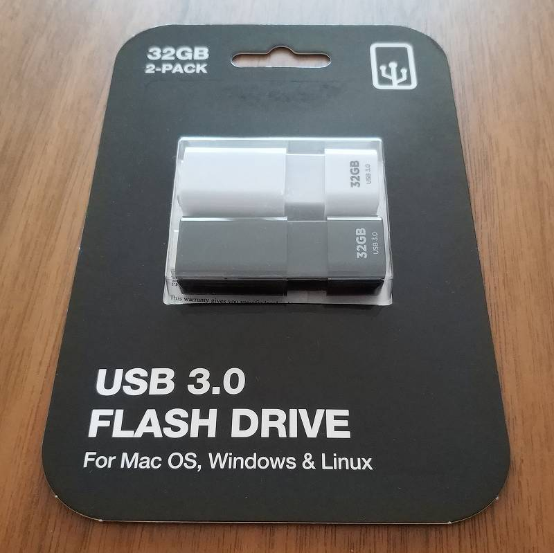
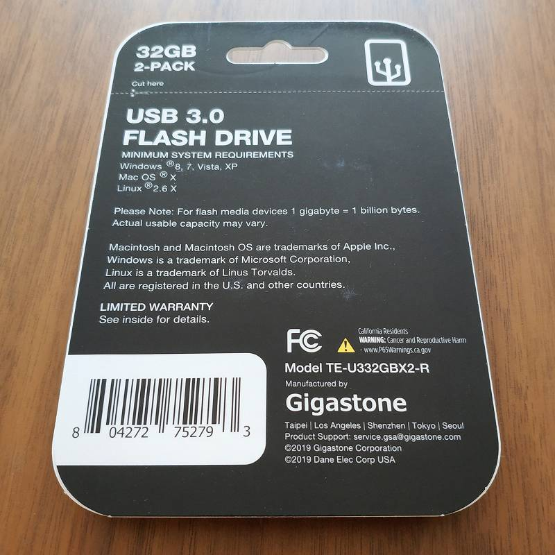

# 概要

現在市場に出回っているUSBメモリは書き込み速度がピンキリで 64GBの容量なのに書き込み速度 5MB/s のような使い物にならないレベルのものがあります。

そこで、書き込み速度を中心に現行品の情報を調べてみました。なお、モデルチェンジで(同型番のまま)書き込み速度が低下することもあるので、実際の情報は異なる可能性があります。

# 個人的な前提

USBメモリは容量が大きいものの方が高速な傾向がありますが、私はブータブルUSB、もしくは小容量のファイルコピーにしか使わないので32GBで十分と考えています。

// ブータブルUSBは32GB以上あっても意味がないことが多い(Windows純正のFAT32フォーマッタが上限32GB)

また信頼性もそこまで気にしません。実際 Sandisk や Samsung の純正品でも壊れるときは壊れますし、コネクタがもげるような物理故障もままあります。そもそも信頼性を求めるなら別のストレージを使います。


# リスト

買える USB 3.0/3.1 32GB モデルを実勢価格・シーケンシャル速度[MB/s]とともに並べました。なお ※ありは実測値、なしは公称値。

### Sandisk

Ultra Fit は 64GB でも $11

* $8 Ultra R160/W40
* $8 Ultra Fit R130/W60

### Western Digital

Sandisk Cruzer Glide の色違い？ブランド展開の意図がよく分からない。

* $6 easystore R38/W17※

### Samsung

microSD なら Sandisk よりもお買い得感があるが、USBメモリは逆。

* $9.5 Samsung BAR Plus R220/W25※

### PNY

128GB 以上でないと速くないっぽい

* $8 Elite Turbo Attache 4 R133/W20

### Lexar

今はLongsysのブランド。結構速いラインナップがある。

* $9 JumpDrive S75 R150/W60

### Team

* $7.5 T183 R85/W20
* $8 C162 R90/W35
* $7 C201 R90/W35

### Adata

S102 Proは実測で速い個体(W50+)もあるっぽい。

* $7.5 S102 Pro Advanced R100/W25

### Verbatim

今はCMCのブランドになった？

* $10 Store 'n' Go V3 R90/W25

# 買ってみた

さて、ここまで書いておいてナンですが Gigastone TE-U332GBX2-R (R90/W45) を買ってみました。32GB 2本で $13。
というのも、Amazonだと$25以上無料配達＆配達2週間、Staplesだと全て無料配達＆翌日配達だったので。





実測を取ってみると書き込み 30MB/s は出たのでヨシ。とはいえこの2本違うチップ積んでるんじゃねという結果。さすがおみくじ Gigastone（？

```
	------------------------------------------------------------------------------
	CrystalDiskMark 7.0.0 x64 (C) 2007-2019 hiyohiyo
	                                  Crystal Dew World: https://crystalmark.info/
	------------------------------------------------------------------------------
	* MB/s = 1,000,000 bytes/s [SATA/600 = 600,000,000 bytes/s]
	* KB = 1000 bytes, KiB = 1024 bytes
	
	[Read]
	Sequential 1MiB (Q=  8, T= 1):    98.365 MB/s [     93.8 IOPS] 
	Sequential 1MiB (Q=  1, T= 1):    98.990 MB/s [     94.4 IOPS] 
	    Random 4KiB (Q= 32, T=16):     5.656 MB/s [   1380.9 IOPS] 
	    Random 4KiB (Q=  1, T= 1):     5.450 MB/s [   1330.6 IOPS] 
	
	[Write]
	Sequential 1MiB (Q=  8, T= 1):    33.136 MB/s [     31.6 IOPS] 
	Sequential 1MiB (Q=  1, T= 1):    28.941 MB/s [     27.6 IOPS] 
	    Random 4KiB (Q= 32, T=16):     0.710 MB/s [    173.3 IOPS] 
	    Random 4KiB (Q=  1, T= 1):     0.622 MB/s [    151.9 IOPS] 
	
	Profile: Default
	   Test: 1 GiB (x5) [Interval: 5 sec] <defaultaffinity>
	     OS: Windows 10 Professional [10.0 Build 18363] (x64)
	Comment: Gigastone TE-U332GBX2-R USB3.0 FLASH DRIVE 32GB (白)
```

なぜか黒のほうが速い

```
	------------------------------------------------------------------------------
	CrystalDiskMark 7.0.0 x64 (C) 2007-2019 hiyohiyo
	                                  Crystal Dew World: https://crystalmark.info/
	------------------------------------------------------------------------------
	* MB/s = 1,000,000 bytes/s [SATA/600 = 600,000,000 bytes/s]
	* KB = 1000 bytes, KiB = 1024 bytes
	
	[Read]
	Sequential 1MiB (Q=  8, T= 1):   110.937 MB/s [    105.8 IOPS] 
	Sequential 1MiB (Q=  1, T= 1):   111.157 MB/s [    106.0 IOPS] 
	    Random 4KiB (Q= 32, T=16):     7.396 MB/s [   1805.7 IOPS] 
	    Random 4KiB (Q=  1, T= 1):     6.213 MB/s [   1516.8 IOPS] 
	
	[Write]
	Sequential 1MiB (Q=  8, T= 1):    41.312 MB/s [     39.4 IOPS] 
	Sequential 1MiB (Q=  1, T= 1):    40.268 MB/s [     38.4 IOPS] 
	    Random 4KiB (Q= 32, T=16):     1.274 MB/s [    311.0 IOPS] 
	    Random 4KiB (Q=  1, T= 1):     1.048 MB/s [    255.9 IOPS] 
	
	Profile: Default
	   Test: 1 GiB (x5) [Interval: 5 sec] <defaultaffinity>
	     OS: Windows 10 Professional [10.0 Build 18363] (x64)
	Comment: Gigastone TE-U332GBX2-R USB3.0 FLASH DRIVE 32GB (黒)
```

特に急がないなら Sandisk Ultra Fit を選ぶのが安牌だと思います。Sandiskは地味に4K速いし。(でも小さいのは取り外ししにくいんだよな・・・