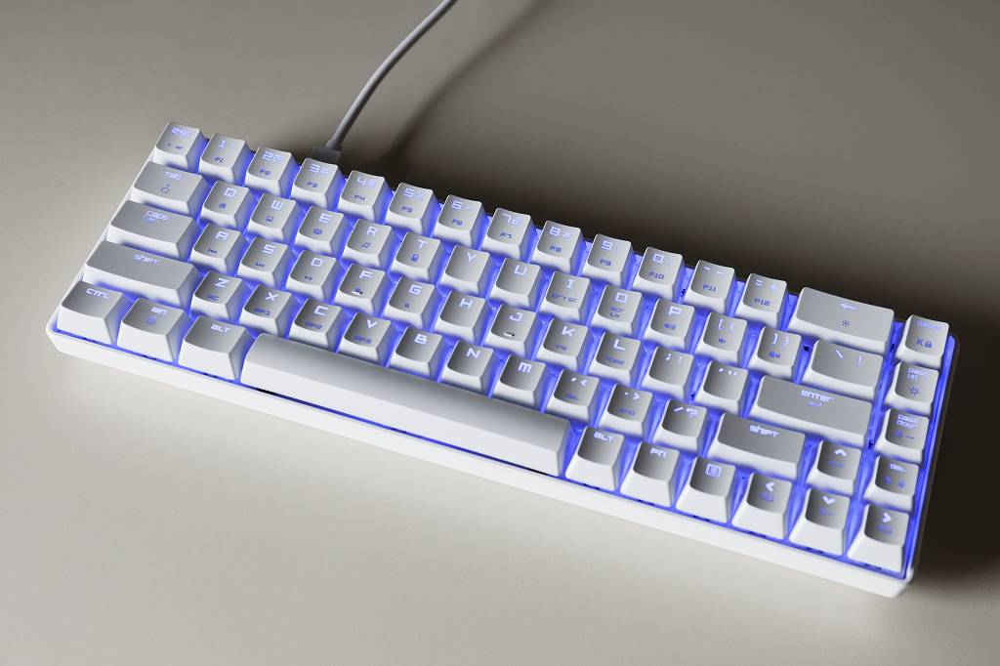

# 概要

フルキーボードのテンキーがマウスとぶつかるのが気になって、$40の廉価60%キーボードを買ったので設定や調べたことなどのまとめ。

# 仕様

個人的に 右Alt、右Ctrl、右Shift、CapsLock、アプリケーションキー は不要、カーソルキーは（ショートカットに使うので）必須、
キーバインドをゴリゴリに変更すると環境が変わったときに慣れないので基本的にデフォルトを踏襲、無線は不要、
ついでに15年ぶりに青軸を使ってみようかと思って選んだら以下のものになりました。
NiZ Plum Atom 68 を買おうかとも思ってたんですが、お値段が4倍するのでこれを試してからでも遅くはないだろうという判断です。




* Magic Refiner MK14
* BSUN 青軸
* 普通の60%キーボードより1列多い
* カーソルキーがFn不要
* 右Ctrlがない
* USB-Cコネクタ

# 設定

Fnキーが押しにくく、ファームウェアの改造等も調べるのが面倒だったのでyamy(<https://ja.osdn.net/projects/yamy/>)を使ってキーバインドを変更しました。設定内容は以下の通り。
なおFnキーの入力状態は Windows で取得できないのでFnキー自体を別のキーに割り当てることはできません。（例えばLEDの発光設定を変えたりするのはFnキーでしかできません）

* Alt + Esc を日本語入力 ON/OFF に割り当て
  * Alt + ` がデフォルトの日本語入力 ON/OFF キー
  * Alt + Esc のショートカット入力不能
* SpaceをShiftに割り当て
  * だたしSpaceのみ押した場合はSpaceとして動作
  * 日本語入力時に Shift+Space で半角スペースを入力したい場合は Shift押す、Space押す、Space離す、Shift離す の順で入力すること
  * Shift押す、Space押す、Shift離す、Space離す の順で入力すると全角スペースになる
* CapsLockをFn（と同等の動作）に割り当て
  * ただしCapsLockのみ押した場合はCapsLockとして動作
  * 面倒なのでよく使うファンクションキーのみ設定

実際の設定ファイル(.mayu)の内容は以下の通り。(このファイルをファイル名を変更せずにyamy.exeのあるフォルダに保存しておけば起動時に自動的に読み込まれます)

```
    include "104.mayu"
    keymap Global
    
    key A-Esc = A-BackQuote
    
    mod shift += !!Space
    
    mod mod0 = !!CapsLock
    
    key M0-*_1 = *F1
    key M0-*_2 = *F2
    key M0-*_3 = *F3
    key M0-*_4 = *F4
    key M0-*_5 = *F5
    key M0-*_6 = *F6
    key M0-*_7 = *F7
    key M0-*_8 = *F8
    key M0-*_9 = *F9
    key M0-*_0 = *F10
    key M0-*Minus = *F11
    key M0-*Equal = *F12
```