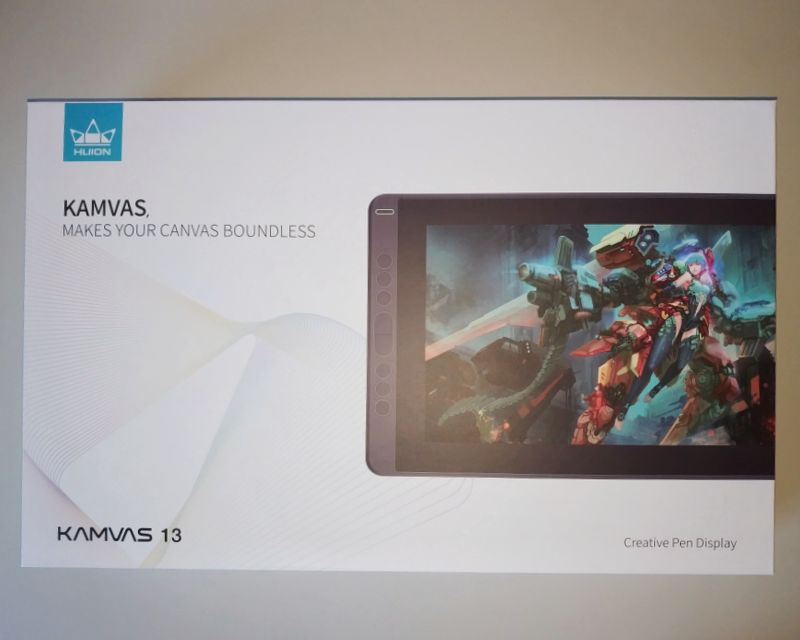
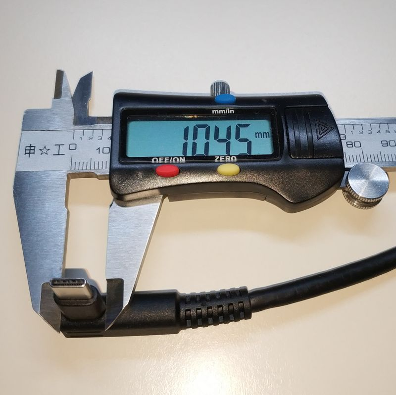
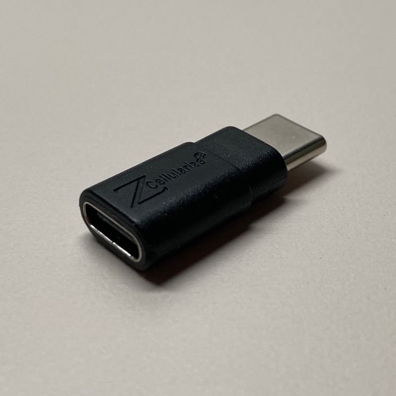

# 概要

中華液タブ(Huion Kamvas 13)を買ったので(主にハードウェアの)レビュー的なまとめ。iPad Pro
を買おうか考えたこともあったので、別にディスるつもりはないのですが、それとの比較も含めて。

# 良かったところ

  * 安価 (約2万円、Apple Pencil 1.4本分、ワコムの最廉価機の半額)
  * 発色がまともで iPhone のように黄色っぽくない
  * 視差は気にならない
  * 保護フイルム貼付け済みで iPad のようにツルツルしない
  * USB Type-C ケーブル1本でPCと接続できる
  *     * オルタネートモード DisplayPortとして認識
  * 遅延は少ない(環境は Ryzen5 3600、GTX1660)
  *     * Affinity Designer で 2フレーム@60Hz 程度
  *     * Krita で 4フレーム@60Hz 程度

# 気になったところ

### ペンが削れやすい

かなりカスが出ます。替芯は20本付きですが人によってはすぐ追加が欲しくなるかもしれません。それに加えて純正の替芯は結構いい値段するみたいです。

### ペンを傾けるとポインタ位置がずれる

手首で描くのではなく腕を使って描けば大きな問題にはならないと思いますが、ペンの傾きに連動してポインタ位置がずれます。
傾き検出できるならドライバでポインタ位置の補償ができそうなものですがどうなんでしょう。ワコムの液タブだとならないらしいですが未確認です。

### 隅の精度が低い

キャリブレーションしても隅だけはポインタ位置がずれます。フルスクリーンで描きたい人は気になるでしょうけど、外周にペイントソフトのメニューやランチャーなどを並
べるのであれば問題にならないと思います。おそらくペン位置検出アンテナのサイズがペン検出領域に対してマージンを持っていないことが原因なんでしょうが未確認です。

### USB-C ケーブルと本体が干渉する

USB-C ケーブル1本でPCと接続できるので非常用のUSB液晶としても便利なのですが、
純正ケーブルのコネクタのシェル部分のサイズが小さいので汎用のケーブルは物理的に干渉します。

写真は 3in1 ケーブル。本体のコネクタ挿入部とのクリアランスは 0.1mm 程度になっており、
接続部分がボキッといって接触不良を起こさないように設計されているようです。

なお Huion Kamvas 13 には USB Type-C
のポートが2つ(3in1ケーブル用とスマホ接続用)搭載されているのですが、なぜかスマホ接続用の方が少し大きくなっています。
そのわずかな差のおかげで以下のような USB Type-C 延長アダプタ(+汎用ケーブル)で干渉せずに接続することができました。

# 参考リンク

<https://www.huion.com/pen_display/Kamvas/kamvas-13.html>

