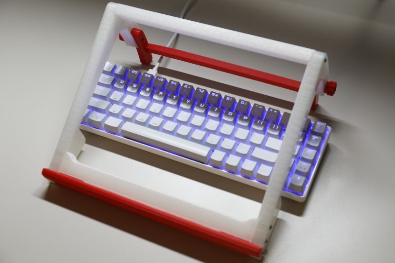
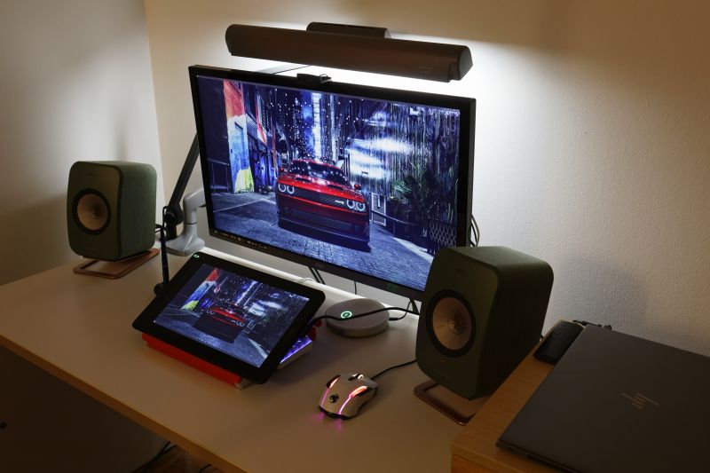

Huion Kamvas 13 をスタンドなしで購入したのですが、USB電源の液晶モニタとして使うときにスタンドが欲しいと思うことが何度もあったので3Dプリ
ントしました（純正スタンド単品に5000円支払うのは負けた気がしますし

自分で設計するのは面倒なので探してみるとピッタリのものがありまして、Kamvas 13 に合わせた設計となっているので手首に出っ張りが当たったりせず、またキ
ーボードをまたいで設置できました。ただし、ネジの受け部分がインサートナットではないのでタッピングネジでないと取り付けに苦労します（STLの修正まではやってい
ません

<https://www.thingiverse.com/thing:4717731>

実際に3Dプリントしたものの写真は以下になります。

正直25cm級のパーツを複数印刷して組み立てるのは始めてだったので、パーツの配置を適当に印刷（X-
Y平面に対して／向きと＼向きを混在させて印刷)したところ長さが揃わずに削るハメになりました。25cm の長さだと 0.4% のズレでも 1mm ずれるので
X-Y軸の直交度の測定すらしていない環境では当然なのですが、そこまで頭が回っていませんでした。

