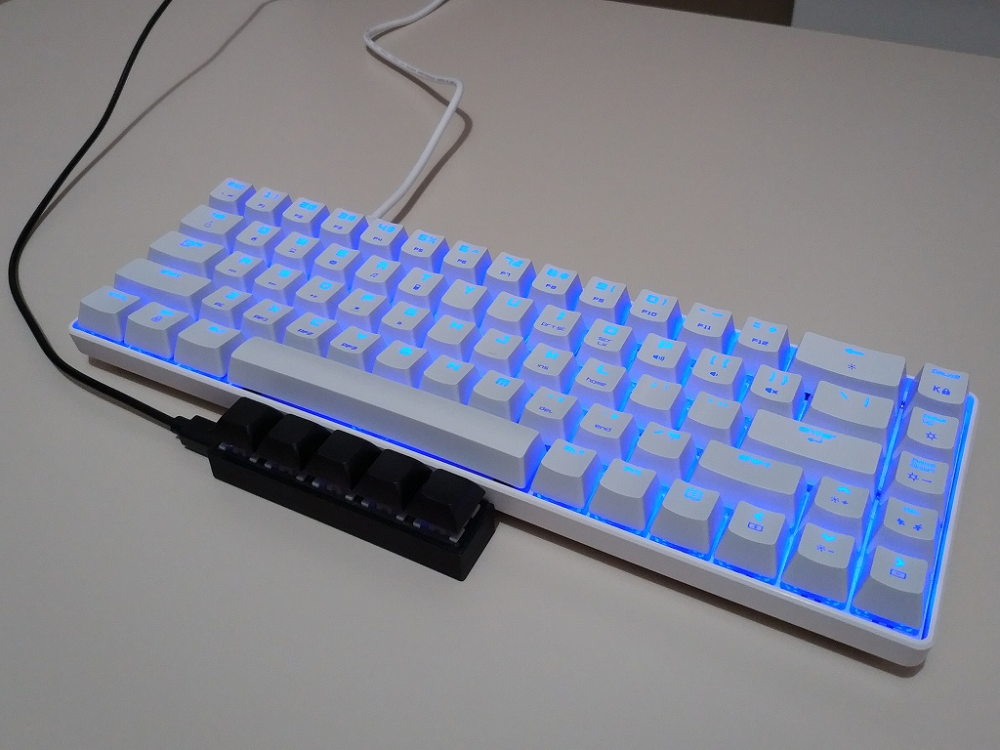

プログラムを長時間書いているとシフトキーを押している左手小指が痛くなってくることがあるので親指でシフトキーを押せるようにAliexpressでプログラマブル
キーボードを買ってみたのでそれに関するまとめ。というかキー設定用のツールをみつけるのに小一時間かかったのでその忘備録。

以下の写真のようにスペースバーの手前にプログラマブルキーボードを配置して、親指でキーを押せるようにしたかった。

買ったのは5キー、outemu
青軸、3Dプリントのケース、USBマイコンがCH551Gらしきもの。以下のページに9キーの同等品を分解している人がいたので詳細は省略。 //
outemuキーは遊びが大きく気に入らないので換えたい

中華製の格安なプログラマブル USBキーボードを買ってみた QMK VIAとは別物
<http://www.neko.ne.jp/~freewing/hardware/usb_programmable_keyboard_china/>

キー設定用のツールとソースコードは以下。

<http://8.210.3.182:9999/man/Readme.html>
<https://github.com/TabbycatPie/CustomKeyboard>
