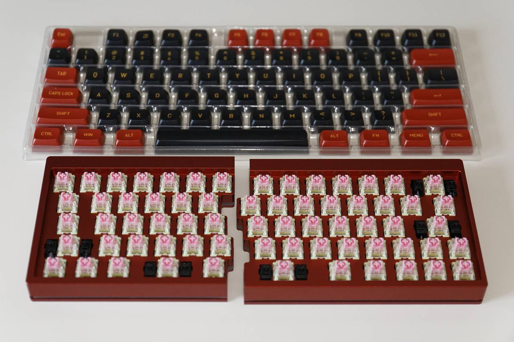
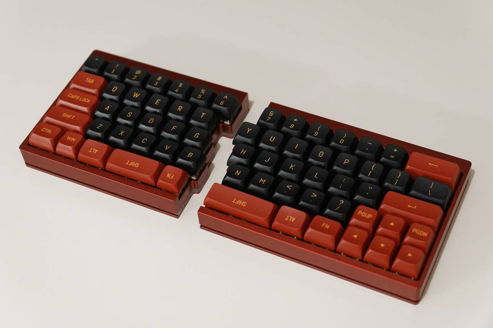

# 概要

Shenzhen YMD Tech split 64 の組み立てに関する覚書

# はじめに

先日、PCキーボードのシフトキーを左手小指で押し続けたことによってひどい腱鞘炎になってしまったので、親指でシフトキーを押せてついでに肩こり対策もできそうな、
キー入力をカスタム可能な分割キーボードを導入しました。

キーボード選択にあたって以下を前提に探すと Ymdk split 64 一択のようだったのでそれを AliExpress で購入しました。

  * ANSI配列(Enterが一段)
  * 6キーが左手側にある
  * 可能なら60%サイズ

# ハードウェア

ベースキット、キースイッチ、キーキャップで完成になるのですが、ベースキットとキースイッチを本家から購入したところ、届いた時点で上の写真の状態（キースイッチ取
り付け済み）で届き、別途用意したキーキャップを差し込むだけで完成しました。

なお色は赤(写真は実物と印象が異なります)、キースイッチは TTC Golden Pink、お値段は約$220でした。

# ファームウェア

専用の設定ソフトウェアもあるのですが、googleアカウントにログインしないとダウンロードできないので、以下のページを参考に QMK toolbox
を使ってファームウェアを書き込みました。 <https://apirak.medium.com/set-key-mapping-for-ymdk-
split-keyboard-with-qmk-4b4aa5f7c7e1>

要点は以下の通り

  * QMK Configurator で [ymdk/sp64](https://config.qmk.fm/#/ymdk/sp64/LAYOUT) を選択して設定・コンパイル
  * QMK Toolbox の MCU は ATmega32A を選択
  * Ymdk split 64 の左Ctrlを押しっぱなしでUSBケーブルをつなぐとブートローダが起動して QMK Toolbox から書き込める
