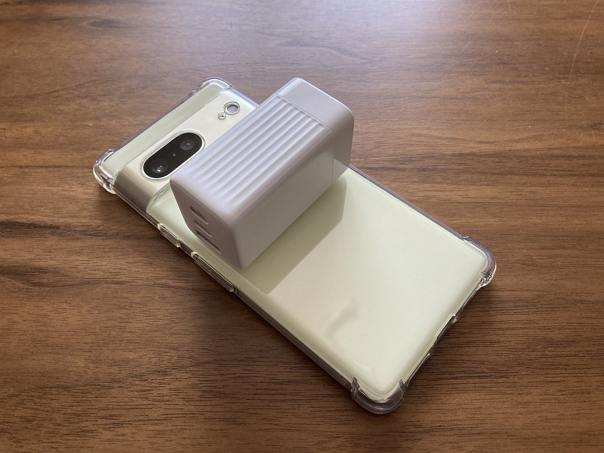

# 概要

旅行用にUSB充電器 (サンワサプライ 700-AC036W) を買った覚書

写真は比較用のスマホに乗せています

# 充電器選定

最近充電器を持ち歩くことが増えたので自宅用と旅行用を分けるために以下の条件で探しました。

  * USB 3口以上
  * プラグが折りたためる
  * USB-PD で 30W 以上出せる
  * 安宿のコンセントでも干渉しにくい

はじめは Anker の適当なものを買おうかと思って Anker 735 Charger
などを検討してみたものの高過ぎるように感じたので、ちょうどセールだったサンワサプライ 700-AC036W
にしました。スマホの幅に収まるサイズってのは実にコンパクトです。

# 比較表

| | 735 Charger | 700-AC036W |
|:-----:|:-----:|:-----:|
| 最大出力 | 65W| 65W |
| セール価格 | \6500 | **\3600** |
| 保証 | **30か月**  | 6か月 |
| 重量 | 132g  | **105g** |
| サイズ | 66x38x29| 65x37x31 |

  * Anker 735 は放熱シリコン充填で重いかわりに放熱しっかり＆保証期間が長いのかも
  * 700-AC036W の USB-PD 供給電圧は 5/9/12/15/20V 
    * 旧仕様なら 5/9/12/20V、現行仕様なら 5/9/15/20V なのでノーブランド品にありがちな両対応なのかも
  * 3ポート同時充電＆大容量機器複数を常用するなら Anker 735 の方が良いかも 
    * 700-AC036W は3ポート同時充電時、1ポートのみ急速充電となる
    * 大容量機器複数なら Anker 737 (120Wタイプ) にすべきかも
