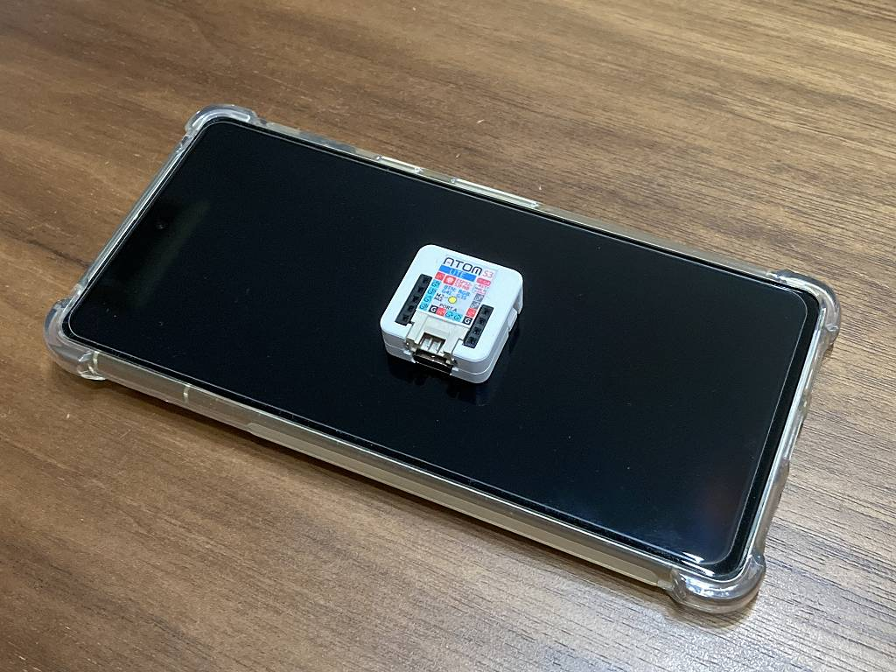

# 概要

M5STACK の AtomS3 Lite を試してみた記録

製品詳細: <https://docs.m5stack.com/en/core/AtomS3%20Lite>

# はじめに

ESP32 を試すのに純正の開発基板を購入したのですが、Amazon Dash Button のようにボタンを押したら WiFi
にパケットを送る程度の用途であれば M5STACK の ATOMS3 Lite が使いやすそうなので試しに買ってみました。特徴は以下の通り。

  * 小型
  * 軽量
  * 純正基板より安価
  * 押しボタン・RGBLED内蔵
  * ブレッドボード・ユニバーサル基板に取り付け可能

スマホに乗せてもこのサイズ。まさにバッテリーレスな Dash Button です。

# 使ってみる

[ESP32 で HEOS デバイスを叩く](../712482392300027904/)

で作成したコードを移植・修正・機能追加して動作を確認しました。どちらも ESP32-S3 なので何も問題なくスルっと動きました。

# サンプルコード

貼り付けるには大きくなってしまったので以下にプッシュしました。

  * <https://github.com/sokosun/atoms3_heos_control>

