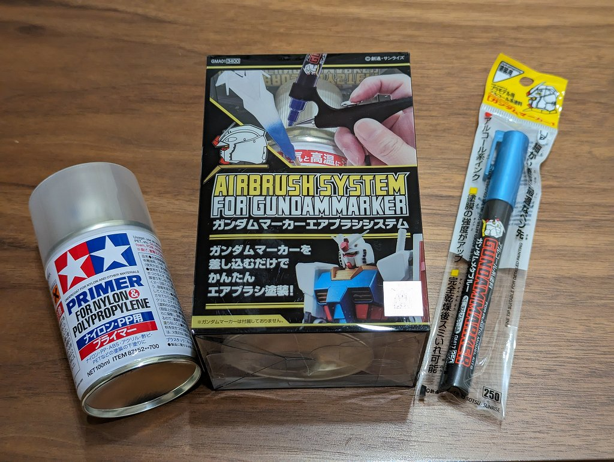

# 概要

ABS のキーキャップをガンダムマーカーエアブラシで塗装してみた記録

# 準備

塗装にあたり以下のものを用意しました。ABS はアルコールで割れやすくなるらしいので要プライマー。

  * ABS キーキャップ (未塗装)
  * プライマー
  * ガンダムマーカーエアブラシシステム
  * ガンダムマーカー

# 完成写真

塗装時の多少のムラはちゃんと引けて写真で見る限りはそれなりに映えるものになりました。顔料の粒子が大きいらしく平滑性はでておらず触るとざらつきを感じます。

# メモ

  * プライマー -> 2時間乾燥 -> 塗装 -> 2時間乾燥 という流れでそれなりに(待ち)時間がかかる 
    * プライマーは透明なのでキーキャップの塗装前の色の個体差が完成後にも残る
    * 可能なら下地塗りを入れたほうが良い
  * ガンダムマーカーのペン先がすぐ乾くので、キーキャップ1個噴くたびにペン先を押してインクを出す作業が必要 
    * キーキャップ10個以上の塗装なら普通のエアブラシの方が良さそう
  * ガンダムマーカー塗装は（クリアーを噴いても）剥げやすいらしいのでキーボード用途には向かないかもしれない 
    * 1日数回しか叩かないマクロパッド用途なら十分
  * ガンダムマーカーエアブラシシステムは普通のエアブラシの代用にはならないけど片付けが一瞬なのは本当に楽

